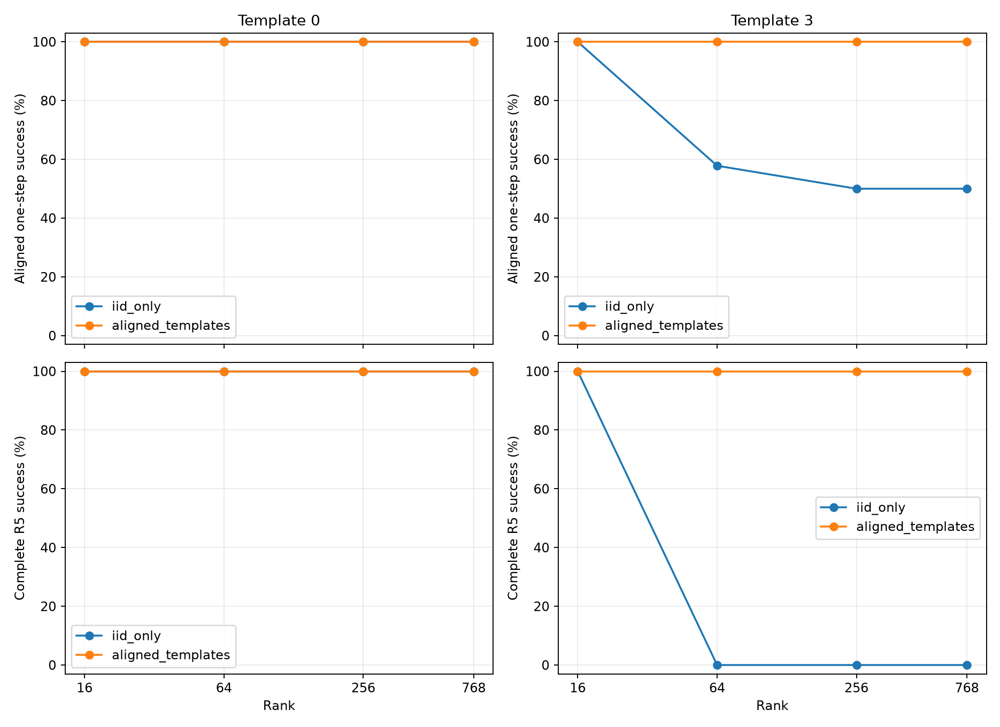

# 规范写入可达性与残差语义：闭式分析

本轮只执行实验 A、B。冻结 BART encoder、decoder 与三个 CE rank-16 编辑器，神经网络参数更新次数为 0；没有启动实验 C，也没有增加编辑器 seed。RRR 与时间探针均为规范编码上的闭式拟合。

## 核心结果与方法选择

**在所测 mask 对齐状态图中，rank-16 已能实现近似规范且可组合的写入。** 只在模板 0 拟合的 RRR-16，对齐单步成功及非目标保持在模板 0／3 都为 100%。既有往返路径的 R1–R5 在两个模板都为 100%；跨三个时间状态的事后补测中，两条 IID 路径均为 100%，结构 OOD 两条路径分别为 100% 与 95%（76/80）。三个 CE seed 在这些路径上的 R5 都为 0%，重编码均为 100%。同时拟合模板 0、3 时，RRR-16 的补测四格全部为 100%，但模板 3 此时不能再称结构 OOD。

| 全程对齐五步路径 | 仅拟合模板 0 的 RRR-16 | CE，三个 seed 各自 | 重编码，三个 seed 各自 |
| --- | --- | --- | --- |
| IID，从 0 往返 | 100% | 0% | 100% |
| IID，从 +1／−1 跨三个状态 | 两条均 100% | 两条均 0% | 两条均 100% |
| 模板 3，从 0 往返 | 100% | 0% | 100% |
| 模板 3，从 +1／−1 跨三个状态 | 100%／95% | 两条均 0% | 两条均 100% |

每格 80 个历史留出 worlds；100% 的 Wilson 95% 区间为 [95.42%, 100%]，0% 为 [0%, 4.58%]，95% 的区间见[补充表](results/alignment_followup_summary.csv)。RRR 是一个确定性解，不把对三个 S 的测量当三个独立 RRR seed。OOD 的四个失败包含第二步追加日期碎片的语法错误；即使后续终点恢复，完整轨迹仍计失败。

规范残差也同步下降：IID plus 的 token MSE，RRR-16 为 0.000113，三个 CE seed 为 0.00966–0.01097；在 S42 上的坐标 MSE 分别约为 0.000273 与 1.09–1.85。因此不是仅换了一种解码技巧。这里仍是近似规范写入，没有声称 T(Ex) 与 E(y) 完全相等。提高秩虽降低拟合 L2，却可能降低结构 OOD 表现：只拟合模板 0 的 rank 64／256／768 在原始模板 3 往返路径上 R5 都为 0%。

**必须排除 token 对齐覆盖混淆。** 原 reordered 从 0 连做两个 plus，第二步 −1→−2 改变 token 长度，未进入 token 对齐拟合；所有秩在该顺序失败，不能作为 rank 不足证据。模板编号相同并不保证状态转换 mask 对齐。初始全部结果仍保留在 CSV 中，两条补测明确标为事后分析：[对齐顺序补测](FOLLOWUP.md)。

**残差的语义依赖具体转换。** 1→0 的历史匹配对上，正交补探针三 seed 都指向目标，ridge 修补当前与下一步均 100% 成功；在原始投影失败的 0→−1 上，正交补探针三 seed 都指向源 0，共享 full 探针的 S 贡献支持目标 −1，而正交补贡献支持源。后者支持“不同方向提供冲突时间证据”的解释，但 S 独立探针只有 49%–55% 规范 IID 准确率，不能直接把 S 分类标签当成可靠的新值编码：[原始状态对照](INITIAL_CONTROLS.md)。

原投影不对称确有幅度混淆：0→−1 编辑状态的 ridge 位移范数为 11.7–13.3，规范状态自身仅 0.33–0.39。把编辑状态的同一大位移施加到规范状态也会使当前逐字保持降到 0%；同范数随机位移在编辑状态上仍保留 52%–85%。因此既有局部脆弱性，也有方向特异性，不能简化为“任意扰动都会致败”。历史 CE 无修补主路径的第二步，三个 seed × 模板 0／3 六格各 80/80 都属于不可解析／语法无效，不能直接写成仅损坏非目标事实。

**下一步优先固定 rank-16、匹配数据覆盖，比较 CE 与 CE＋规范 L2／RRR 初始化。** 当前结果建立了能力类内可组合写法的存在性证据，尚未严格分离目标、数据覆盖和优化方式的因果作用。无需先加 rank，也不再扩展投影估计器。本轮没有训练 C；新 worlds 与五 seed 的独立确认也尚未执行。全部五个 GPU 作业合计 845 秒（14.08 GPU 分钟），峰值一张 GPU，初始及两项补充审计均通过。

## 设计与解释边界

沿用 96 个拟合 worlds 和 80 个历史分析留出 worlds，内容组合不重叠。留出 worlds 在之前已评估，不能声称新独立确认。只拟合模板 0 的条件中，模板 3 是结构 OOD；模板 0、3 都参与拟合的条件中，模板 3 仅是留出 world 泛化。

每个合法相邻状态转换先检查 attention mask 相同，仅对相同者拟合 token 级共享仿射写入。截距不受惩罚。RRR 精确求解 mean-token 平方误差加 ridge 的秩约束目标：对增广设计的白化交叉协方差做 SVD 截断。它是该正则化目标的闭式最优解，不是所有数据分布、所有目标下的能力上界。三个 ridge 系数只用 80/16 的拟合 world 内部分割选择，然后在全部 96 个拟合 worlds 上重拟合。没有用评测输出选模型。

[锁定协议](protocol.json)；[ridge 选择记录](results/ridge_selection.csv)；[mask 对齐覆盖](results/alignment_coverage.csv)。链同时测两个既有操作顺序，均从状态 0 开始。重编码保留同一 CE 操作，只在续步前编码上一步实际输出；不是把 gold 文本喂给编辑器。

## 秩、单步保护和完整轨迹

| 模型 | 模板 | 对齐单步成功 | 非目标保持 | R1 | R2 | R3 | R4 | R5 | R5 95% CI |
| --- | --- | --- | --- | --- | --- | --- | --- | --- | --- |
| CE_s42 | 0 | 100.00% | 100.00% | 100.00% | 0.00% | 0.00% | 0.00% | 0.00% | [0.00%, 4.58%] |
| CE_s42 | 3 | 99.38% | 100.00% | 100.00% | 0.00% | 0.00% | 0.00% | 0.00% | [0.00%, 4.58%] |
| CE_s43 | 0 | 100.00% | 100.00% | 100.00% | 0.00% | 0.00% | 0.00% | 0.00% | [0.00%, 4.58%] |
| CE_s43 | 3 | 99.38% | 100.00% | 100.00% | 0.00% | 0.00% | 0.00% | 0.00% | [0.00%, 4.58%] |
| CE_s44 | 0 | 100.00% | 100.00% | 100.00% | 0.00% | 0.00% | 0.00% | 0.00% | [0.00%, 4.58%] |
| CE_s44 | 3 | 100.00% | 100.00% | 100.00% | 0.00% | 0.00% | 0.00% | 0.00% | [0.00%, 4.58%] |
| RRR_aligned_templates_r16 | 0 | 100.00% | 100.00% | 100.00% | 100.00% | 100.00% | 100.00% | 100.00% | [95.42%, 100.00%] |
| RRR_aligned_templates_r16 | 3 | 100.00% | 100.00% | 100.00% | 100.00% | 100.00% | 100.00% | 100.00% | [95.42%, 100.00%] |
| RRR_aligned_templates_r256 | 0 | 100.00% | 100.00% | 100.00% | 100.00% | 100.00% | 100.00% | 100.00% | [95.42%, 100.00%] |
| RRR_aligned_templates_r256 | 3 | 100.00% | 100.00% | 100.00% | 100.00% | 100.00% | 100.00% | 100.00% | [95.42%, 100.00%] |
| RRR_aligned_templates_r64 | 0 | 100.00% | 100.00% | 100.00% | 100.00% | 100.00% | 100.00% | 100.00% | [95.42%, 100.00%] |
| RRR_aligned_templates_r64 | 3 | 100.00% | 100.00% | 100.00% | 100.00% | 100.00% | 100.00% | 100.00% | [95.42%, 100.00%] |
| RRR_aligned_templates_r768 | 0 | 100.00% | 100.00% | 100.00% | 100.00% | 100.00% | 100.00% | 100.00% | [95.42%, 100.00%] |
| RRR_aligned_templates_r768 | 3 | 100.00% | 100.00% | 100.00% | 100.00% | 100.00% | 100.00% | 100.00% | [95.42%, 100.00%] |
| RRR_iid_only_r16 | 0 | 100.00% | 100.00% | 100.00% | 100.00% | 100.00% | 100.00% | 100.00% | [95.42%, 100.00%] |
| RRR_iid_only_r16 | 3 | 100.00% | 100.00% | 100.00% | 100.00% | 100.00% | 100.00% | 100.00% | [95.42%, 100.00%] |
| RRR_iid_only_r256 | 0 | 100.00% | 100.00% | 100.00% | 100.00% | 100.00% | 100.00% | 100.00% | [95.42%, 100.00%] |
| RRR_iid_only_r256 | 3 | 50.00% | 50.00% | 100.00% | 48.75% | 48.75% | 0.00% | 0.00% | [0.00%, 4.58%] |
| RRR_iid_only_r64 | 0 | 100.00% | 100.00% | 100.00% | 100.00% | 100.00% | 100.00% | 100.00% | [95.42%, 100.00%] |
| RRR_iid_only_r64 | 3 | 57.81% | 57.81% | 100.00% | 0.00% | 0.00% | 0.00% | 0.00% | [0.00%, 4.58%] |
| RRR_iid_only_r768 | 0 | 100.00% | 100.00% | 100.00% | 100.00% | 100.00% | 100.00% | 100.00% | [95.42%, 100.00%] |
| RRR_iid_only_r768 | 3 | 50.00% | 50.00% | 100.00% | 71.25% | 71.25% | 0.00% | 0.00% | [0.00%, 4.58%] |
| reencode_s42 | 0 | 100.00% | 100.00% | 100.00% | 100.00% | 100.00% | 100.00% | 100.00% | [95.42%, 100.00%] |
| reencode_s42 | 3 | 99.38% | 100.00% | 100.00% | 100.00% | 100.00% | 100.00% | 100.00% | [95.42%, 100.00%] |
| reencode_s43 | 0 | 100.00% | 100.00% | 100.00% | 100.00% | 100.00% | 100.00% | 100.00% | [95.42%, 100.00%] |
| reencode_s43 | 3 | 99.38% | 100.00% | 100.00% | 100.00% | 100.00% | 100.00% | 100.00% | [95.42%, 100.00%] |
| reencode_s44 | 0 | 100.00% | 100.00% | 100.00% | 100.00% | 100.00% | 100.00% | 100.00% | [95.42%, 100.00%] |
| reencode_s44 | 3 | 100.00% | 100.00% | 100.00% | 100.00% | 100.00% | 100.00% | 100.00% | [95.42%, 100.00%] |

单步表覆盖所有 mask 对齐的合法相邻转换，链 R1 只从状态 0 出发，两者不能直接混用。单步置信区间按 world 对重复转换取平均后 bootstrap；每个链格的 80 个 world 用 Wilson 区间。条件续步仅在此前整个前缀成功的 worlds 上计算，无合格前缀时为 NA。确定性 RRR 只有一个解，不复制成三个 seed。

[全部单步与保护率](results/single_summary.csv)；[完整轨迹、条件续步与终点率](results/chain_summary.csv)；[逐 world 输出](results/evaluation.jsonl)。后一个文件中保留全部实际文本。

## 理想写入残差有没有下降

| 模型 | 模板 | 操作 | token MSE | S42 坐标 MSE | S43 坐标 MSE | S44 坐标 MSE |
| --- | --- | --- | --- | --- | --- | --- |
| CE_s42 | 0 | plus | 0.0109652 | 1.85335 | 1.31798 | 1.12725 |
| CE_s42 | 0 | minus | 0.0104972 | 0.664113 | 0.678645 | 0.599572 |
| CE_s42 | 3 | plus | 0.0099682 | 1.70811 | 1.20937 | 1.02913 |
| CE_s42 | 3 | minus | 0.00838288 | 0.531257 | 0.542645 | 0.477726 |
| CE_s43 | 0 | plus | 0.00965711 | 1.08844 | 1.59977 | 1.15177 |
| CE_s43 | 0 | minus | 0.0129941 | 0.968675 | 0.914713 | 0.703671 |
| CE_s43 | 3 | plus | 0.00833999 | 0.955371 | 1.39592 | 1.00239 |
| CE_s43 | 3 | minus | 0.0110888 | 0.821074 | 0.776045 | 0.584615 |
| CE_s44 | 0 | plus | 0.0102437 | 1.0995 | 1.41278 | 1.69466 |
| CE_s44 | 0 | minus | 0.0120061 | 0.989288 | 0.878217 | 0.718017 |
| CE_s44 | 3 | plus | 0.00905146 | 0.985288 | 1.26173 | 1.51436 |
| CE_s44 | 3 | minus | 0.00991292 | 0.813585 | 0.717166 | 0.581292 |
| RRR_aligned_templates_r16 | 0 | plus | 0.000128412 | 0.00038378 | 0.000410598 | 0.000424161 |
| RRR_aligned_templates_r16 | 0 | minus | 0.000132925 | 0.000526463 | 0.000571331 | 0.000626938 |
| RRR_aligned_templates_r16 | 3 | plus | 9.09733e-05 | 0.000280111 | 0.00029897 | 0.000313632 |
| RRR_aligned_templates_r16 | 3 | minus | 9.39938e-05 | 0.000347629 | 0.000375543 | 0.000423009 |
| RRR_aligned_templates_r256 | 0 | plus | 6.94472e-05 | 0.000321784 | 0.000334983 | 0.000374627 |
| RRR_aligned_templates_r256 | 0 | minus | 7.78658e-05 | 0.000460798 | 0.000494019 | 0.000566704 |
| RRR_aligned_templates_r256 | 3 | plus | 5.29398e-05 | 0.000244428 | 0.00025722 | 0.000283052 |
| RRR_aligned_templates_r256 | 3 | minus | 5.84136e-05 | 0.000323695 | 0.00035472 | 0.000413041 |
| RRR_aligned_templates_r64 | 0 | plus | 8.22192e-05 | 0.000333888 | 0.000343606 | 0.000385415 |
| RRR_aligned_templates_r64 | 0 | minus | 8.97452e-05 | 0.000473376 | 0.000502931 | 0.000580891 |
| RRR_aligned_templates_r64 | 3 | plus | 6.08681e-05 | 0.000250043 | 0.000263086 | 0.000288134 |
| RRR_aligned_templates_r64 | 3 | minus | 6.58793e-05 | 0.00032776 | 0.000356251 | 0.000413933 |
| RRR_aligned_templates_r768 | 0 | plus | 6.85136e-05 | 0.000321441 | 0.000334266 | 0.000373917 |
| RRR_aligned_templates_r768 | 0 | minus | 7.6954e-05 | 0.000460473 | 0.00049372 | 0.000566592 |
| RRR_aligned_templates_r768 | 3 | plus | 5.24308e-05 | 0.000244518 | 0.000257292 | 0.000283218 |
| RRR_aligned_templates_r768 | 3 | minus | 5.79138e-05 | 0.000323224 | 0.000353806 | 0.000412542 |
| RRR_iid_only_r16 | 0 | plus | 0.000113346 | 0.000273247 | 0.000288741 | 0.000296714 |
| RRR_iid_only_r16 | 0 | minus | 0.000116628 | 0.000347054 | 0.000359696 | 0.000392816 |
| RRR_iid_only_r16 | 3 | plus | 0.00258605 | 0.0371421 | 0.0529934 | 0.0623876 |
| RRR_iid_only_r16 | 3 | minus | 0.00250989 | 0.0436636 | 0.0452789 | 0.0484244 |
| RRR_iid_only_r256 | 0 | plus | 5.03034e-05 | 0.000216185 | 0.000220983 | 0.000247613 |
| RRR_iid_only_r256 | 0 | minus | 5.69696e-05 | 0.000291467 | 0.000299864 | 0.00034856 |
| RRR_iid_only_r256 | 3 | plus | 0.00667542 | 0.0557212 | 0.0696117 | 0.0802854 |
| RRR_iid_only_r256 | 3 | minus | 0.00713081 | 0.0391348 | 0.0463046 | 0.0491715 |
| RRR_iid_only_r64 | 0 | plus | 6.25249e-05 | 0.000223891 | 0.000228734 | 0.00025443 |
| RRR_iid_only_r64 | 0 | minus | 6.84534e-05 | 0.000300803 | 0.000306769 | 0.000355723 |
| RRR_iid_only_r64 | 3 | plus | 0.00508298 | 0.0475075 | 0.0656385 | 0.0751938 |
| RRR_iid_only_r64 | 3 | minus | 0.00563468 | 0.039857 | 0.0456385 | 0.0483684 |
| RRR_iid_only_r768 | 0 | plus | 4.9531e-05 | 0.000215976 | 0.000220837 | 0.000247597 |
| RRR_iid_only_r768 | 0 | minus | 5.62085e-05 | 0.000290998 | 0.000299553 | 0.000347999 |
| RRR_iid_only_r768 | 3 | plus | 0.0068343 | 0.0564214 | 0.0701518 | 0.0806258 |
| RRR_iid_only_r768 | 3 | minus | 0.00727809 | 0.0392437 | 0.0463554 | 0.0490649 |
| reencode_s42 | 0 | plus | 0.0109652 | 1.85335 | 1.31798 | 1.12725 |
| reencode_s42 | 0 | minus | 0.0104972 | 0.664113 | 0.678645 | 0.599572 |
| reencode_s42 | 3 | plus | 0.0099682 | 1.70811 | 1.20937 | 1.02913 |
| reencode_s42 | 3 | minus | 0.00838288 | 0.531257 | 0.542645 | 0.477726 |
| reencode_s43 | 0 | plus | 0.00965711 | 1.08844 | 1.59977 | 1.15177 |
| reencode_s43 | 0 | minus | 0.0129941 | 0.968675 | 0.914713 | 0.703671 |
| reencode_s43 | 3 | plus | 0.00833999 | 0.955371 | 1.39592 | 1.00239 |
| reencode_s43 | 3 | minus | 0.0110888 | 0.821074 | 0.776045 | 0.584615 |
| reencode_s44 | 0 | plus | 0.0102437 | 1.0995 | 1.41278 | 1.69466 |
| reencode_s44 | 0 | minus | 0.0120061 | 0.989288 | 0.878217 | 0.718017 |
| reencode_s44 | 3 | plus | 0.00905146 | 0.985288 | 1.26173 | 1.51436 |
| reencode_s44 | 3 | minus | 0.00991292 | 0.813585 | 0.717166 | 0.581292 |

这里只对 attention mask 对齐的 source/target 报潜空间 MSE；不对齐的转换依然生成和评估语义，但潜空间残差标为 NA。MSE 是每个有效 token／坐标的平均，再等权平均 world 与转换。S 是上一轮只在拟合 worlds 上得到的三个 PCA4 基。L2 下降与解码成功是两个指标；全秩失败只能说明这个拟合设计及 L2 目标不足，不能严格证明规范变化在总体上不可线性表示。

[残差表](results/residual_summary.csv)。

## 幅度匹配位移：方向与整体脆弱性

使用上一轮 1→0 的历史匹配对。先在编辑状态上计算实际 ridge 位移，随机全空间位移与随机 4 维位移逐 world 匹配其 masked-token Frobenius 范数。把相同实际位移及同范数随机位移分别施加到编辑状态和对应规范状态上；不再使用范数远小的 random_ridge 作为这项对照。随机方向重复四次，区间按 world 聚类。

| seed | 状态 | 位移 | 范数 | 当前逐字保持 | 当前成功 | 下一步成功 | 当前保持 CI |
| --- | --- | --- | --- | --- | --- | --- | --- |
| 42 | edited | none | 0.0000 | 100.00% | 100.00% | 0.00% | [95.42%, 100.00%] |
| 42 | edited | ridge_delta | 13.9712 | 100.00% | 100.00% | 100.00% | [95.42%, 100.00%] |
| 42 | edited | random_full | 13.9712 | 68.12% | 68.12% | 0.00% | [62.50%, 73.44%] |
| 42 | edited | random4 | 13.9712 | 39.69% | 41.25% | 0.00% | [34.38%, 45.00%] |
| 42 | canonical | none | 0.0000 | 100.00% | 100.00% | 100.00% | [95.42%, 100.00%] |
| 42 | canonical | ridge_delta | 13.9712 | 0.00% | 0.00% | 0.00% | [0.00%, 4.58%] |
| 42 | canonical | random_full | 13.9712 | 79.38% | 79.69% | 49.06% | [74.69%, 83.75%] |
| 42 | canonical | random4 | 13.9712 | 41.88% | 44.69% | 37.19% | [36.88%, 46.88%] |
| 43 | edited | none | 0.0000 | 100.00% | 100.00% | 0.00% | [95.42%, 100.00%] |
| 43 | edited | ridge_delta | 12.7849 | 100.00% | 100.00% | 100.00% | [95.42%, 100.00%] |
| 43 | edited | random_full | 12.7849 | 71.88% | 71.88% | 0.00% | [66.25%, 77.20%] |
| 43 | edited | random4 | 12.7849 | 82.50% | 83.12% | 0.00% | [79.06%, 85.94%] |
| 43 | canonical | none | 0.0000 | 100.00% | 100.00% | 100.00% | [95.42%, 100.00%] |
| 43 | canonical | ridge_delta | 12.7849 | 0.00% | 0.00% | 0.00% | [0.00%, 4.58%] |
| 43 | canonical | random_full | 12.7849 | 76.88% | 77.50% | 74.38% | [73.44%, 80.31%] |
| 43 | canonical | random4 | 12.7849 | 74.69% | 76.88% | 80.31% | [70.30%, 78.75%] |
| 44 | edited | none | 0.0000 | 100.00% | 100.00% | 0.00% | [95.42%, 100.00%] |
| 44 | edited | ridge_delta | 13.0223 | 100.00% | 100.00% | 100.00% | [95.42%, 100.00%] |
| 44 | edited | random_full | 13.0223 | 63.44% | 64.06% | 0.00% | [59.06%, 67.81%] |
| 44 | edited | random4 | 13.0223 | 72.50% | 73.12% | 0.00% | [68.12%, 76.88%] |
| 44 | canonical | none | 0.0000 | 100.00% | 100.00% | 100.00% | [95.42%, 100.00%] |
| 44 | canonical | ridge_delta | 13.0223 | 0.00% | 0.00% | 0.00% | [0.00%, 4.58%] |
| 44 | canonical | random_full | 13.0223 | 73.44% | 73.75% | 74.69% | [68.75%, 77.81%] |
| 44 | canonical | random4 | 13.0223 | 68.44% | 70.31% | 68.75% | [62.81%, 74.38%] |

参考状态接受的是编辑状态计算出的同一位移，因此这项表检验相同扰动在两种状态上的不对称；不是另算一个较小的规范状态位移。下一步使用同 seed 的 plus 编辑器。

[匹配对照表](results/matched_control_summary.csv)；[逐样本对照](results/matched_controls.jsonl)。

## 时间探针先校准，再解释

只用模板 0 的规范编码、七个时间状态拟合七分类 ridge 探针。分别报告 full、S 与 S 正交补上各自拟合的探针，并分解同一 full 探针的 target-minus-source margin。S 探针准确率不足时，不能把其输出标签解释成可靠的状态载体。

| seed | 模板 | 分量 | 规范状态准确率 | world bootstrap CI |
| --- | --- | --- | --- | --- |
| 42 | 0 | full | 100.00% | [100.00%, 100.00%] |
| 42 | 0 | S | 55.36% | [52.32%, 58.40%] |
| 42 | 0 | complement | 100.00% | [100.00%, 100.00%] |
| 42 | 3 | full | 28.75% | [28.57%, 29.11%] |
| 42 | 3 | S | 24.64% | [22.86%, 26.43%] |
| 42 | 3 | complement | 30.00% | [29.11%, 31.07%] |
| 43 | 0 | full | 100.00% | [100.00%, 100.00%] |
| 43 | 0 | S | 52.68% | [49.28%, 56.07%] |
| 43 | 0 | complement | 100.00% | [100.00%, 100.00%] |
| 43 | 3 | full | 28.75% | [28.57%, 29.11%] |
| 43 | 3 | S | 27.68% | [26.96%, 28.39%] |
| 43 | 3 | complement | 32.14% | [30.89%, 33.57%] |
| 44 | 0 | full | 100.00% | [100.00%, 100.00%] |
| 44 | 0 | S | 48.93% | [45.89%, 51.79%] |
| 44 | 0 | complement | 100.00% | [100.00%, 100.00%] |
| 44 | 3 | full | 28.75% | [28.57%, 29.11%] |
| 44 | 3 | S | 36.07% | [34.29%, 38.04%] |
| 44 | 3 | complement | 32.32% | [31.07%, 33.75%] |

| seed | 状态 | full→目标 | S→目标 | S→源 | 正交补→目标 | 正交补→源 | 共享 S margin | 共享正交补 margin |
| --- | --- | --- | --- | --- | --- | --- | --- | --- |
| 42 | edited | 0.00% | 0.00% | 0.00% | 100.00% | 0.00% | -2.82551 | 1.08093 |
| 42 | canonical_target | 100.00% | 91.25% | 0.00% | 100.00% | 0.00% | 0.38557 | 0.60996 |
| 43 | edited | 0.00% | 0.00% | 100.00% | 100.00% | 0.00% | -2.79446 | 1.49989 |
| 43 | canonical_target | 100.00% | 78.75% | 1.25% | 100.00% | 0.00% | 0.46452 | 0.53101 |
| 44 | edited | 0.00% | 0.00% | 100.00% | 100.00% | 0.00% | -1.64421 | 0.99740 |
| 44 | canonical_target | 100.00% | 70.00% | 0.00% | 100.00% | 0.00% | 0.50495 | 0.49058 |

这里的源状态固定为 +1，目标为 0。margin 为目标 logit 减源 logit，正数支持目标；两个共享分量贡献加独立列出的 bias 等于 full margin。它们是相关性诊断，不是探针本身的因果证据。

[校准表](results/probe_calibration_summary.csv)；[状态与置信区间](results/probe_state_summary.csv)；[逐样本 margin](results/probe_states.jsonl)。

## 续步失败的内容

| seed | 模板 | 第二步类别 | 数目 | 失败中的占比 |
| --- | --- | --- | --- | --- |
| 42 | 0 | unparseable_or_invalid_grammar | 80 | 100.00% |
| 42 | 3 | unparseable_or_invalid_grammar | 80 | 100.00% |
| 43 | 0 | unparseable_or_invalid_grammar | 80 | 100.00% |
| 43 | 3 | unparseable_or_invalid_grammar | 80 | 100.00% |
| 44 | 0 | unparseable_or_invalid_grammar | 80 | 100.00% |
| 44 | 3 | unparseable_or_invalid_grammar | 80 | 100.00% |

分类优先级：不可解析／语法不合规／未正常结束 → 非目标事实损坏 → 编辑未执行 → 其他错误状态。另存 target、preserved、parseable 等重叠标签，避免优先级掩盖共同失败。错误状态标记多走一步、历史状态或其他状态；仅凭文本无法辨认“复制旧状态”的来源。受控时间模板没有出现人物槽，非目标项主要是物体、颜色、数量、status，模板 3 还包括绝对日期，不能泛化成自然文本人物保持结论。

上一轮模板 2 的输出也单独分类，但其单步地板效应不用于组合机制结论。OOD 随机马氏距离高于 S 的现象也不能直接证明是另一机制：不同预测器性能只构成机制异质性的线索。

[全部错误类别](results/failure_summary.csv)；[逐条标签](results/failure_categories.jsonl)。

## 下一步决策与机制措辞

RRR-16 在所测 IID 主轨迹上达到较高 R5，规范拟合目标下已存在可组合写法。这支持先研究目标欠约束，而无需先提高 rank。仍须核对另一顺序、单步非目标保护与模板 3，不能从一个顺序推出任意链长可达。

上一轮 S 正交补注入三个 seed 均致败，读取分量单独注入也有 34%–80% 致败；因此两类分量都能独立产生失败，正交补效应更强。读取分量属于编辑器读取空间，并不足以单独证明编辑器放大是唯一中介。CE 的多解和 seed42 离群同样是目标欠约束的线索，而不是已证明的成因。

本轮不继续尝试新的无参考投影估计器，也不训练 C。若后续训练规范 L2 或续步等价目标，应检验 S 残差、S 注入敏感性和跨 seed 子空间是否共同改善；其中子空间角度还需结合残差能量及 eigengap，接近零残差时 PCA 方向本身可能不稳定。最终论文确认需另锁新 worlds 与 5 个 seed，当前三个历史 seed 不替代确认实验。实用价值以状态有效性及机制为主，不以节省重编码成本为主。

实际 GPU 分配：845 秒，峰值 1 张 GPU；CPU 闭式拟合不计作神经网络训练。

[审计](results/audit.json)；[资源账本](results/resources.json)；[源码与产物哈希](results/artifact_manifest.json)；[复现说明](README.md)。

## 补充：排除 token 对齐覆盖混淆

[事后对齐顺序实验与综合解读](FOLLOWUP.md)报告两条跨三个时间状态的五步路径、探针反证和成因判断边界。初始 reordered 的未覆盖转换不能用于秩能力结论。

[原始 0→−1 投影失败的幅度匹配对照与探针](INITIAL_CONTROLS.md)：与历史 1→0 对照分开报告。
