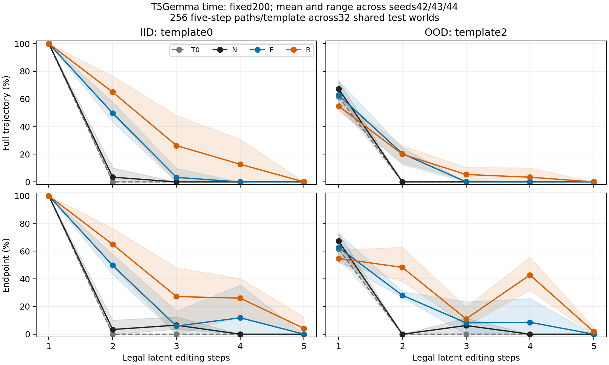

# 当前来源兼容性：实验结果

**全部预定条件与评估已完成。**

当前来源补训R在三个seed的IID自身两步完整率上均优于固定来源F；各方法第一步均正确，因此这项增益发生在正确前缀后的续步。核心旧自然单步均保持100%，逐例旧成功损失为0。

|seed|N自身两步完整|F自身两步完整|R自身两步完整|R减F百分点|
|---|---|---|---|---|
|42|8.66%|45.17%|67.05%|+21.88|
|43|4.55%|45.45%|77.56%|+32.10|
|44|2.41%|63.64%|73.58%|+9.94|

这种优势随来源与长度改变：R对固定T0和独立U来源的IID两步完整率在三个seed上均低于F；自身模板OOD两步优势方向不一致。IID第三步只在42/43改善，44从F的25/256降为R的0/256；第四步只在42/43有成功，所有条件、三个seed的五步完整率均为0。OOD第三步R在三个seed上有小幅改善，但绝对完整率仅1.17%–10.55%。这是局部长度迁移，长链问题仍未解决。

核心单步保护没有覆盖所有表达：R的模板OOD自然单步相对T0在三个seed均下降。训练中R也保留了错误前缀，OOD的部分endpoint增益属于错误前缀恢复。行为结果支持当前来源补训在本设置的自身两步编辑中有帮助，未确定来源滞后是唯一失败机制。

9个正式训练运行均完成200更新，21个checkpoint评估全部完成，333312条主预测已复算；3个核心准入均通过，未完成或仍运行项目为0。4次工程失败分配均已修复恢复，失败开销计入资源总数，没有作为语义失败计分。详细分项、区间、恢复记录和评估器边界如下。

模型google/t5gemma-2b-2b-ul2-it，原子T0 seeds42/43/44，各600步已选checkpoint；骨干冻结，两个rank16操作头共152064参数。N/F/R从各seed同一T0出发，各200 optimizer updates，800自然replay+800续步。训练覆盖全部合法当前状态及操作头输出标签；R仅一次前缀、每20更新重建、detach，不筛除错误。主checkpoint固定200，100仅诊断。

沿用96/24/32世界划分；IID与模板OOD共享32个测试世界，是同世界不同表达，不能当64个独立世界。旧自然测试768行/seed原样保留；IID/OOD穷举两步各704序列，长链每种模板在32个世界上合计256条序列、每步1–5。实际独立世界仍为32。U循环下一seed的原子T0，是来源对照，不是第四次训练重复。

## 原始能力与准入

|seed|重构|原子|gold续步|通过|
|---|---|---|---|---|
|42|100.00%|100.00%|100.00%|True|
|43|100.00%|100.00%|100.00%|True|
|44|100.00%|100.00%|100.00%|True|

准入针对原有核心dev。模板OOD是另外的表达留出测量，没有被当作通过核心准入即可保证的能力。其自然单步及gold-reencode对照单列，OOD失败同时可能包含表达识别不足。

|seed|条件|测试|自然单步macro|成功|
|---|---|---|---|---|
|42|T0|iid|100.00%|768/768|
|42|T0|ood|58.33%|224/384|
|42|N|iid|100.00%|768/768|
|42|N|ood|65.36%|251/384|
|42|F|iid|100.00%|768/768|
|42|F|ood|51.56%|198/384|
|42|R|iid|100.00%|768/768|
|42|R|ood|51.04%|196/384|
|43|T0|iid|100.00%|768/768|
|43|T0|ood|53.65%|206/384|
|43|N|iid|100.00%|768/768|
|43|N|ood|51.82%|199/384|
|43|F|iid|100.00%|768/768|
|43|F|ood|58.59%|225/384|
|43|R|iid|100.00%|768/768|
|43|R|ood|51.30%|197/384|
|44|T0|iid|100.00%|768/768|
|44|T0|ood|60.68%|233/384|
|44|N|iid|100.00%|768/768|
|44|N|ood|60.16%|231/384|
|44|F|iid|100.00%|768/768|
|44|F|ood|69.53%|267/384|
|44|R|iid|100.00%|768/768|
|44|R|ood|57.29%|220/384|

## 自身运行：逐seed主结果

|seed|条件|测试|第一步|第二步endpoint|两步完整|条件续步|
|---|---|---|---|---|---|---|
|42|T0|iid|704/704|0/704|0/704|0/704|
|42|T0|ood|384/704|0/704|0/704|0/384|
|42|N|iid|704/704|61/704|61/704|61/704|
|42|N|ood|438/704|0/704|0/704|0/438|
|42|F|iid|704/704|318/704|318/704|318/704|
|42|F|ood|332/704|158/704|126/704|126/332|
|42|R|iid|704/704|472/704|472/704|472/704|
|42|R|ood|328/704|199/704|120/704|120/328|
|43|T0|iid|704/704|0/704|0/704|0/704|
|43|T0|ood|348/704|33/704|2/704|2/348|
|43|N|iid|704/704|32/704|32/704|32/704|
|43|N|ood|362/704|0/704|0/704|0/362|
|43|F|iid|704/704|320/704|320/704|320/704|
|43|F|ood|386/704|167/704|97/704|97/386|
|43|R|iid|704/704|546/704|546/704|546/704|
|43|R|ood|330/704|314/704|104/704|104/330|
|44|T0|iid|704/704|0/704|0/704|0/704|
|44|T0|ood|402/704|52/704|30/704|30/402|
|44|N|iid|704/704|17/704|17/704|17/704|
|44|N|ood|398/704|33/704|0/704|0/398|
|44|F|iid|704/704|448/704|448/704|448/704|
|44|F|ood|470/704|198/704|152/704|152/470|
|44|R|iid|704/704|518/704|518/704|518/704|
|44|R|ood|376/704|465/704|223/704|223/376|

条件分母因模型而变化，不用于单独排名；错误前缀恢复可以提高endpoint，full2仍失败。长度2穷举集与后面的五步路径初始分布不同。

## 均值与范围

|条件|测试|来源|指标|seeds|均值|最小|最大|
|---|---|---|---|---|---|---|---|
|T0|iid|natural|atomic_macro|3|100.00%|100.00%|100.00%|
|T0|ood|natural|atomic_macro|3|57.55%|53.65%|60.68%|
|T0|iid|self|full2|3|0.00%|0.00%|0.00%|
|T0|ood|self|full2|3|1.52%|0.00%|4.26%|
|T0|iid|latent|full3_all|3|0.00%|0.00%|0.00%|
|T0|iid|latent|full4_all|3|0.00%|0.00%|0.00%|
|T0|iid|latent|full5_all|3|0.00%|0.00%|0.00%|
|T0|ood|latent|full3_all|3|0.00%|0.00%|0.00%|
|T0|ood|latent|full4_all|3|0.00%|0.00%|0.00%|
|T0|ood|latent|full5_all|3|0.00%|0.00%|0.00%|
|N|iid|natural|atomic_macro|3|100.00%|100.00%|100.00%|
|N|ood|natural|atomic_macro|3|59.11%|51.82%|65.36%|
|N|iid|self|full2|3|5.21%|2.41%|8.66%|
|N|ood|self|full2|3|0.00%|0.00%|0.00%|
|N|iid|latent|full3_all|3|0.00%|0.00%|0.00%|
|N|iid|latent|full4_all|3|0.00%|0.00%|0.00%|
|N|iid|latent|full5_all|3|0.00%|0.00%|0.00%|
|N|ood|latent|full3_all|3|0.00%|0.00%|0.00%|
|N|ood|latent|full4_all|3|0.00%|0.00%|0.00%|
|N|ood|latent|full5_all|3|0.00%|0.00%|0.00%|
|F|iid|natural|atomic_macro|3|100.00%|100.00%|100.00%|
|F|ood|natural|atomic_macro|3|59.90%|51.56%|69.53%|
|F|iid|self|full2|3|51.42%|45.17%|63.64%|
|F|ood|self|full2|3|17.76%|13.78%|21.59%|
|F|iid|latent|full3_all|3|3.26%|0.00%|9.77%|
|F|iid|latent|full4_all|3|0.00%|0.00%|0.00%|
|F|iid|latent|full5_all|3|0.00%|0.00%|0.00%|
|F|ood|latent|full3_all|3|0.00%|0.00%|0.00%|
|F|ood|latent|full4_all|3|0.00%|0.00%|0.00%|
|F|ood|latent|full5_all|3|0.00%|0.00%|0.00%|
|R|iid|natural|atomic_macro|3|100.00%|100.00%|100.00%|
|R|ood|natural|atomic_macro|3|53.21%|51.04%|57.29%|
|R|iid|self|full2|3|72.73%|67.05%|77.56%|
|R|ood|self|full2|3|21.16%|14.77%|31.68%|
|R|iid|latent|full3_all|3|26.30%|0.00%|48.05%|
|R|iid|latent|full4_all|3|12.76%|0.00%|30.86%|
|R|iid|latent|full5_all|3|0.00%|0.00%|0.00%|
|R|ood|latent|full3_all|3|5.34%|1.17%|10.55%|
|R|ood|latent|full4_all|3|3.39%|0.00%|10.16%|
|R|ood|latent|full5_all|3|0.00%|0.00%|0.00%|

均值及范围保留训练seed层级；逐seed结果为主。条件成功率无有效分母时记NA，不补零。完整分项另见mean_and_range.csv、continuation_cells.csv、sequence_metrics.csv及quality_metrics.csv。

## R−F、F−N：固定世界配对

|seed|对比|测试|来源|指标|集合|差值pp|世界CI|世界|
|---|---|---|---|---|---|---|---|---|
|42|F-N|iid|fixed_T0|full2|all|+87.50|[+86.22,+88.78]|32|
|42|F-N|ood|fixed_T0|full2|all|+21.16|[+20.45,+21.88]|32|
|42|F-N|iid|U|full2|all|+61.51|[+59.80,+63.07]|32|
|42|F-N|ood|U|full2|all|+19.18|[+17.76,+20.45]|32|
|42|F-N|iid|self|full2|all|+36.51|[+34.09,+38.78]|32|
|42|F-N|ood|self|full2|all|+17.90|[+16.90,+18.89]|32|
|42|F-N|iid|gold_reencode|full2|all|+0.00|[+0.00,+0.00]|32|
|42|F-N|ood|gold_reencode|full2|all|-22.59|[-24.72,-20.45]|32|
|42|F-N|iid|actual_reencode|full2|all|+0.00|[+0.00,+0.00]|32|
|42|F-N|ood|actual_reencode|full2|all|-26.42|[-28.98,-23.72]|32|
|42|F-N|iid|latent|full3_all|long_paths|+0.00|[+0.00,+0.00]|32|
|42|F-N|iid|latent|full4_all|long_paths|+0.00|[+0.00,+0.00]|32|
|42|F-N|iid|latent|full5_all|long_paths|+0.00|[+0.00,+0.00]|32|
|42|F-N|ood|latent|full3_all|long_paths|+0.00|[+0.00,+0.00]|32|
|42|F-N|ood|latent|full4_all|long_paths|+0.00|[+0.00,+0.00]|32|
|42|F-N|ood|latent|full5_all|long_paths|+0.00|[+0.00,+0.00]|32|
|42|R-F|iid|fixed_T0|full2|all|-37.93|[-38.78,-36.93]|32|
|42|R-F|ood|fixed_T0|full2|all|-7.53|[-8.24,-6.82]|32|
|42|R-F|iid|U|full2|all|-20.74|[-23.01,-18.47]|32|
|42|R-F|ood|U|full2|all|-12.50|[-13.21,-11.65]|32|
|42|R-F|iid|self|full2|all|+21.88|[+19.74,+24.15]|32|
|42|R-F|ood|self|full2|all|-0.85|[-1.99,+0.28]|32|
|42|R-F|iid|gold_reencode|full2|all|+0.00|[+0.00,+0.00]|32|
|42|R-F|ood|gold_reencode|full2|all|-0.85|[-2.13,+0.00]|32|
|42|R-F|iid|actual_reencode|full2|all|+0.00|[+0.00,+0.00]|32|
|42|R-F|ood|actual_reencode|full2|all|-0.28|[-1.70,+0.85]|32|
|42|R-F|iid|latent|full3_all|long_paths|+30.86|[+27.34,+33.59]|32|
|42|R-F|iid|latent|full4_all|long_paths|+7.42|[+5.08,+9.38]|32|
|42|R-F|iid|latent|full5_all|long_paths|+0.00|[+0.00,+0.00]|32|
|42|R-F|ood|latent|full3_all|long_paths|+4.30|[+2.34,+6.64]|32|
|42|R-F|ood|latent|full4_all|long_paths|+0.00|[+0.00,+0.00]|32|
|42|R-F|ood|latent|full5_all|long_paths|+0.00|[+0.00,+0.00]|32|
|43|F-N|iid|fixed_T0|full2|all|+93.32|[+92.61,+94.03]|32|
|43|F-N|ood|fixed_T0|full2|all|+30.82|[+29.55,+32.24]|32|
|43|F-N|iid|U|full2|all|+78.84|[+77.41,+80.26]|32|
|43|F-N|ood|U|full2|all|+14.77|[+14.20,+15.48]|32|
|43|F-N|iid|self|full2|all|+40.91|[+37.93,+43.75]|32|
|43|F-N|ood|self|full2|all|+13.78|[+12.50,+15.20]|32|
|43|F-N|iid|gold_reencode|full2|all|+0.00|[+0.00,+0.00]|32|
|43|F-N|ood|gold_reencode|full2|all|+11.08|[+8.10,+14.49]|32|
|43|F-N|iid|actual_reencode|full2|all|+0.00|[+0.00,+0.00]|32|
|43|F-N|ood|actual_reencode|full2|all|+11.08|[+7.10,+14.91]|32|
|43|F-N|iid|latent|full3_all|long_paths|+0.00|[+0.00,+0.00]|32|
|43|F-N|iid|latent|full4_all|long_paths|+0.00|[+0.00,+0.00]|32|
|43|F-N|iid|latent|full5_all|long_paths|+0.00|[+0.00,+0.00]|32|
|43|F-N|ood|latent|full3_all|long_paths|+0.00|[+0.00,+0.00]|32|
|43|F-N|ood|latent|full4_all|long_paths|+0.00|[+0.00,+0.00]|32|
|43|F-N|ood|latent|full5_all|long_paths|+0.00|[+0.00,+0.00]|32|
|43|R-F|iid|fixed_T0|full2|all|-45.45|[-47.73,-43.04]|32|
|43|R-F|ood|fixed_T0|full2|all|-26.28|[-27.70,-24.86]|32|
|43|R-F|iid|U|full2|all|-37.50|[-39.35,-35.51]|32|
|43|R-F|ood|U|full2|all|-8.24|[-9.23,-7.10]|32|
|43|R-F|iid|self|full2|all|+32.10|[+28.69,+35.65]|32|
|43|R-F|ood|self|full2|all|+0.99|[-0.57,+2.56]|32|
|43|R-F|iid|gold_reencode|full2|all|+0.00|[+0.00,+0.00]|32|
|43|R-F|ood|gold_reencode|full2|all|-11.93|[-14.06,-9.80]|32|
|43|R-F|iid|actual_reencode|full2|all|+0.00|[+0.00,+0.00]|32|
|43|R-F|ood|actual_reencode|full2|all|-14.49|[-16.90,-12.07]|32|
|43|R-F|iid|latent|full3_all|long_paths|+48.05|[+46.48,+49.22]|32|
|43|R-F|iid|latent|full4_all|long_paths|+30.86|[+28.12,+33.20]|32|
|43|R-F|iid|latent|full5_all|long_paths|+0.00|[+0.00,+0.00]|32|
|43|R-F|ood|latent|full3_all|long_paths|+10.55|[+8.98,+12.11]|32|
|43|R-F|ood|latent|full4_all|long_paths|+10.16|[+8.20,+11.72]|32|
|43|R-F|ood|latent|full5_all|long_paths|+0.00|[+0.00,+0.00]|32|
|44|F-N|iid|fixed_T0|full2|all|+100.00|[+100.00,+100.00]|32|
|44|F-N|ood|fixed_T0|full2|all|+38.78|[+36.22,+41.62]|32|
|44|F-N|iid|U|full2|all|+75.00|[+73.72,+76.28]|32|
|44|F-N|ood|U|full2|all|+8.81|[+8.10,+9.52]|32|
|44|F-N|iid|self|full2|all|+61.22|[+58.38,+63.92]|32|
|44|F-N|ood|self|full2|all|+21.59|[+20.45,+22.73]|32|
|44|F-N|iid|gold_reencode|full2|all|+0.00|[+0.00,+0.00]|32|
|44|F-N|ood|gold_reencode|full2|all|+10.80|[+8.38,+13.21]|32|
|44|F-N|iid|actual_reencode|full2|all|+0.00|[+0.00,+0.00]|32|
|44|F-N|ood|actual_reencode|full2|all|+16.05|[+12.50,+19.60]|32|
|44|F-N|iid|latent|full3_all|long_paths|+9.77|[+7.81,+11.33]|32|
|44|F-N|iid|latent|full4_all|long_paths|+0.00|[+0.00,+0.00]|32|
|44|F-N|iid|latent|full5_all|long_paths|+0.00|[+0.00,+0.00]|32|
|44|F-N|ood|latent|full3_all|long_paths|+0.00|[+0.00,+0.00]|32|
|44|F-N|ood|latent|full4_all|long_paths|+0.00|[+0.00,+0.00]|32|
|44|F-N|ood|latent|full5_all|long_paths|+0.00|[+0.00,+0.00]|32|
|44|R-F|iid|fixed_T0|full2|all|-57.10|[-58.10,-55.97]|32|
|44|R-F|ood|fixed_T0|full2|all|-28.41|[-30.68,-26.28]|32|
|44|R-F|iid|U|full2|all|-39.77|[-41.19,-38.35]|32|
|44|R-F|ood|U|full2|all|-4.26|[-4.97,-3.55]|32|
|44|R-F|iid|self|full2|all|+9.94|[+6.53,+13.64]|32|
|44|R-F|ood|self|full2|all|+10.09|[+8.66,+11.51]|32|
|44|R-F|iid|gold_reencode|full2|all|+0.00|[+0.00,+0.00]|32|
|44|R-F|ood|gold_reencode|full2|all|-15.48|[-17.47,-13.35]|32|
|44|R-F|iid|actual_reencode|full2|all|+0.00|[+0.00,+0.00]|32|
|44|R-F|ood|actual_reencode|full2|all|-24.29|[-27.13,-21.31]|32|
|44|R-F|iid|latent|full3_all|long_paths|-9.77|[-11.33,-7.81]|32|
|44|R-F|iid|latent|full4_all|long_paths|+0.00|[+0.00,+0.00]|32|
|44|R-F|iid|latent|full5_all|long_paths|+0.00|[+0.00,+0.00]|32|
|44|R-F|ood|latent|full3_all|long_paths|+1.17|[+0.00,+2.73]|32|
|44|R-F|ood|latent|full4_all|long_paths|+0.00|[+0.00,+0.00]|32|
|44|R-F|ood|latent|full5_all|long_paths|+0.00|[+0.00,+0.00]|32|

2000次按世界聚类的paired bootstrap，共享世界及其所有序列；区间只描述固定训练模型的内容抽样，不含完整训练随机性。零差区间[0,0]不证明总体效应严格为零。

## 长度迁移与重编码控制

|seed|条件|测试|方法|指标|成功|
|---|---|---|---|---|---|
|42|T0|iid|latent|full2_all|0/256|
|42|T0|iid|latent|full3_all|0/256|
|42|T0|iid|latent|full4_all|0/256|
|42|T0|iid|latent|full5_all|0/256|
|42|T0|iid|gold_reencode|full2_all|256/256|
|42|T0|iid|gold_reencode|full3_all|256/256|
|42|T0|iid|gold_reencode|full4_all|256/256|
|42|T0|iid|gold_reencode|full5_all|256/256|
|42|T0|iid|actual_reencode|full2_all|256/256|
|42|T0|iid|actual_reencode|full3_all|256/256|
|42|T0|iid|actual_reencode|full4_all|256/256|
|42|T0|iid|actual_reencode|full5_all|256/256|
|42|T0|ood|latent|full2_all|0/256|
|42|T0|ood|latent|full3_all|0/256|
|42|T0|ood|latent|full4_all|0/256|
|42|T0|ood|latent|full5_all|0/256|
|42|T0|ood|gold_reencode|full2_all|96/256|
|42|T0|ood|gold_reencode|full3_all|64/256|
|42|T0|ood|gold_reencode|full4_all|64/256|
|42|T0|ood|gold_reencode|full5_all|64/256|
|42|T0|ood|actual_reencode|full2_all|128/256|
|42|T0|ood|actual_reencode|full3_all|128/256|
|42|T0|ood|actual_reencode|full4_all|128/256|
|42|T0|ood|actual_reencode|full5_all|128/256|
|42|N|iid|latent|full2_all|26/256|
|42|N|iid|latent|full3_all|0/256|
|42|N|iid|latent|full4_all|0/256|
|42|N|iid|latent|full5_all|0/256|
|42|N|iid|gold_reencode|full2_all|256/256|
|42|N|iid|gold_reencode|full3_all|256/256|
|42|N|iid|gold_reencode|full4_all|256/256|
|42|N|iid|gold_reencode|full5_all|256/256|
|42|N|iid|actual_reencode|full2_all|256/256|
|42|N|iid|actual_reencode|full3_all|256/256|
|42|N|iid|actual_reencode|full4_all|256/256|
|42|N|iid|actual_reencode|full5_all|256/256|
|42|N|ood|latent|full2_all|0/256|
|42|N|ood|latent|full3_all|0/256|
|42|N|ood|latent|full4_all|0/256|
|42|N|ood|latent|full5_all|0/256|
|42|N|ood|gold_reencode|full2_all|123/256|
|42|N|ood|gold_reencode|full3_all|64/256|
|42|N|ood|gold_reencode|full4_all|64/256|
|42|N|ood|gold_reencode|full5_all|64/256|
|42|N|ood|actual_reencode|full2_all|150/256|
|42|N|ood|actual_reencode|full3_all|118/256|
|42|N|ood|actual_reencode|full4_all|118/256|
|42|N|ood|actual_reencode|full5_all|118/256|
|42|F|iid|latent|full2_all|123/256|
|42|F|iid|latent|full3_all|0/256|
|42|F|iid|latent|full4_all|0/256|
|42|F|iid|latent|full5_all|0/256|
|42|F|iid|gold_reencode|full2_all|256/256|
|42|F|iid|gold_reencode|full3_all|256/256|
|42|F|iid|gold_reencode|full4_all|256/256|
|42|F|iid|gold_reencode|full5_all|256/256|
|42|F|iid|actual_reencode|full2_all|256/256|
|42|F|iid|actual_reencode|full3_all|256/256|
|42|F|iid|actual_reencode|full4_all|256/256|
|42|F|iid|actual_reencode|full5_all|256/256|
|42|F|ood|latent|full2_all|62/256|
|42|F|ood|latent|full3_all|0/256|
|42|F|ood|latent|full4_all|0/256|
|42|F|ood|latent|full5_all|0/256|
|42|F|ood|gold_reencode|full2_all|70/256|
|42|F|ood|gold_reencode|full3_all|64/256|
|42|F|ood|gold_reencode|full4_all|64/256|
|42|F|ood|gold_reencode|full5_all|64/256|
|42|F|ood|actual_reencode|full2_all|70/256|
|42|F|ood|actual_reencode|full3_all|64/256|
|42|F|ood|actual_reencode|full4_all|64/256|
|42|F|ood|actual_reencode|full5_all|64/256|
|42|R|iid|latent|full2_all|126/256|
|42|R|iid|latent|full3_all|79/256|
|42|R|iid|latent|full4_all|19/256|
|42|R|iid|latent|full5_all|0/256|
|42|R|iid|gold_reencode|full2_all|256/256|
|42|R|iid|gold_reencode|full3_all|256/256|
|42|R|iid|gold_reencode|full4_all|256/256|
|42|R|iid|gold_reencode|full5_all|256/256|
|42|R|iid|actual_reencode|full2_all|256/256|
|42|R|iid|actual_reencode|full3_all|256/256|
|42|R|iid|actual_reencode|full4_all|256/256|
|42|R|iid|actual_reencode|full5_all|256/256|
|42|R|ood|latent|full2_all|52/256|
|42|R|ood|latent|full3_all|11/256|
|42|R|ood|latent|full4_all|0/256|
|42|R|ood|latent|full5_all|0/256|
|42|R|ood|gold_reencode|full2_all|68/256|
|42|R|ood|gold_reencode|full3_all|64/256|
|42|R|ood|gold_reencode|full4_all|64/256|
|42|R|ood|gold_reencode|full5_all|64/256|
|42|R|ood|actual_reencode|full2_all|72/256|
|42|R|ood|actual_reencode|full3_all|72/256|
|42|R|ood|actual_reencode|full4_all|72/256|
|42|R|ood|actual_reencode|full5_all|72/256|
|43|T0|iid|latent|full2_all|0/256|
|43|T0|iid|latent|full3_all|0/256|
|43|T0|iid|latent|full4_all|0/256|
|43|T0|iid|latent|full5_all|0/256|
|43|T0|iid|gold_reencode|full2_all|256/256|
|43|T0|iid|gold_reencode|full3_all|256/256|
|43|T0|iid|gold_reencode|full4_all|256/256|
|43|T0|iid|gold_reencode|full5_all|256/256|
|43|T0|iid|actual_reencode|full2_all|256/256|
|43|T0|iid|actual_reencode|full3_all|256/256|
|43|T0|iid|actual_reencode|full4_all|256/256|
|43|T0|iid|actual_reencode|full5_all|256/256|
|43|T0|ood|latent|full2_all|0/256|
|43|T0|ood|latent|full3_all|0/256|
|43|T0|ood|latent|full4_all|0/256|
|43|T0|ood|latent|full5_all|0/256|
|43|T0|ood|gold_reencode|full2_all|80/256|
|43|T0|ood|gold_reencode|full3_all|64/256|
|43|T0|ood|gold_reencode|full4_all|64/256|
|43|T0|ood|gold_reencode|full5_all|64/256|
|43|T0|ood|actual_reencode|full2_all|96/256|
|43|T0|ood|actual_reencode|full3_all|96/256|
|43|T0|ood|actual_reencode|full4_all|96/256|
|43|T0|ood|actual_reencode|full5_all|96/256|
|43|N|iid|latent|full2_all|0/256|
|43|N|iid|latent|full3_all|0/256|
|43|N|iid|latent|full4_all|0/256|
|43|N|iid|latent|full5_all|0/256|
|43|N|iid|gold_reencode|full2_all|256/256|
|43|N|iid|gold_reencode|full3_all|256/256|
|43|N|iid|gold_reencode|full4_all|256/256|
|43|N|iid|gold_reencode|full5_all|256/256|
|43|N|iid|actual_reencode|full2_all|256/256|
|43|N|iid|actual_reencode|full3_all|256/256|
|43|N|iid|actual_reencode|full4_all|256/256|
|43|N|iid|actual_reencode|full5_all|256/256|
|43|N|ood|latent|full2_all|0/256|
|43|N|ood|latent|full3_all|0/256|
|43|N|ood|latent|full4_all|0/256|
|43|N|ood|latent|full5_all|0/256|
|43|N|ood|gold_reencode|full2_all|71/256|
|43|N|ood|gold_reencode|full3_all|36/256|
|43|N|ood|gold_reencode|full4_all|36/256|
|43|N|ood|gold_reencode|full5_all|36/256|
|43|N|ood|actual_reencode|full2_all|94/256|
|43|N|ood|actual_reencode|full3_all|82/256|
|43|N|ood|actual_reencode|full4_all|82/256|
|43|N|ood|actual_reencode|full5_all|82/256|
|43|F|iid|latent|full2_all|148/256|
|43|F|iid|latent|full3_all|0/256|
|43|F|iid|latent|full4_all|0/256|
|43|F|iid|latent|full5_all|0/256|
|43|F|iid|gold_reencode|full2_all|256/256|
|43|F|iid|gold_reencode|full3_all|256/256|
|43|F|iid|gold_reencode|full4_all|256/256|
|43|F|iid|gold_reencode|full5_all|256/256|
|43|F|iid|actual_reencode|full2_all|256/256|
|43|F|iid|actual_reencode|full3_all|256/256|
|43|F|iid|actual_reencode|full4_all|256/256|
|43|F|iid|actual_reencode|full5_all|256/256|
|43|F|ood|latent|full2_all|32/256|
|43|F|ood|latent|full3_all|0/256|
|43|F|ood|latent|full4_all|0/256|
|43|F|ood|latent|full5_all|0/256|
|43|F|ood|gold_reencode|full2_all|97/256|
|43|F|ood|gold_reencode|full3_all|64/256|
|43|F|ood|gold_reencode|full4_all|64/256|
|43|F|ood|gold_reencode|full5_all|64/256|
|43|F|ood|actual_reencode|full2_all|120/256|
|43|F|ood|actual_reencode|full3_all|110/256|
|43|F|ood|actual_reencode|full4_all|110/256|
|43|F|ood|actual_reencode|full5_all|110/256|
|43|R|iid|latent|full2_all|196/256|
|43|R|iid|latent|full3_all|123/256|
|43|R|iid|latent|full4_all|79/256|
|43|R|iid|latent|full5_all|0/256|
|43|R|iid|gold_reencode|full2_all|256/256|
|43|R|iid|gold_reencode|full3_all|256/256|
|43|R|iid|gold_reencode|full4_all|256/256|
|43|R|iid|gold_reencode|full5_all|256/256|
|43|R|iid|actual_reencode|full2_all|256/256|
|43|R|iid|actual_reencode|full3_all|256/256|
|43|R|iid|actual_reencode|full4_all|256/256|
|43|R|iid|actual_reencode|full5_all|256/256|
|43|R|ood|latent|full2_all|35/256|
|43|R|ood|latent|full3_all|27/256|
|43|R|ood|latent|full4_all|26/256|
|43|R|ood|latent|full5_all|0/256|
|43|R|ood|gold_reencode|full2_all|69/256|
|43|R|ood|gold_reencode|full3_all|64/256|
|43|R|ood|gold_reencode|full4_all|64/256|
|43|R|ood|gold_reencode|full5_all|64/256|
|43|R|ood|actual_reencode|full2_all|74/256|
|43|R|ood|actual_reencode|full3_all|74/256|
|43|R|ood|actual_reencode|full4_all|74/256|
|43|R|ood|actual_reencode|full5_all|74/256|
|44|T0|iid|latent|full2_all|0/256|
|44|T0|iid|latent|full3_all|0/256|
|44|T0|iid|latent|full4_all|0/256|
|44|T0|iid|latent|full5_all|0/256|
|44|T0|iid|gold_reencode|full2_all|256/256|
|44|T0|iid|gold_reencode|full3_all|256/256|
|44|T0|iid|gold_reencode|full4_all|256/256|
|44|T0|iid|gold_reencode|full5_all|256/256|
|44|T0|iid|actual_reencode|full2_all|256/256|
|44|T0|iid|actual_reencode|full3_all|256/256|
|44|T0|iid|actual_reencode|full4_all|256/256|
|44|T0|iid|actual_reencode|full5_all|256/256|
|44|T0|ood|latent|full2_all|0/256|
|44|T0|ood|latent|full3_all|0/256|
|44|T0|ood|latent|full4_all|0/256|
|44|T0|ood|latent|full5_all|0/256|
|44|T0|ood|gold_reencode|full2_all|105/256|
|44|T0|ood|gold_reencode|full3_all|64/256|
|44|T0|ood|gold_reencode|full4_all|64/256|
|44|T0|ood|gold_reencode|full5_all|64/256|
|44|T0|ood|actual_reencode|full2_all|146/256|
|44|T0|ood|actual_reencode|full3_all|146/256|
|44|T0|ood|actual_reencode|full4_all|146/256|
|44|T0|ood|actual_reencode|full5_all|146/256|
|44|N|iid|latent|full2_all|0/256|
|44|N|iid|latent|full3_all|0/256|
|44|N|iid|latent|full4_all|0/256|
|44|N|iid|latent|full5_all|0/256|
|44|N|iid|gold_reencode|full2_all|256/256|
|44|N|iid|gold_reencode|full3_all|256/256|
|44|N|iid|gold_reencode|full4_all|256/256|
|44|N|iid|gold_reencode|full5_all|256/256|
|44|N|iid|actual_reencode|full2_all|256/256|
|44|N|iid|actual_reencode|full3_all|256/256|
|44|N|iid|actual_reencode|full4_all|256/256|
|44|N|iid|actual_reencode|full5_all|256/256|
|44|N|ood|latent|full2_all|0/256|
|44|N|ood|latent|full3_all|0/256|
|44|N|ood|latent|full4_all|0/256|
|44|N|ood|latent|full5_all|0/256|
|44|N|ood|gold_reencode|full2_all|103/256|
|44|N|ood|gold_reencode|full3_all|64/256|
|44|N|ood|gold_reencode|full4_all|64/256|
|44|N|ood|gold_reencode|full5_all|64/256|
|44|N|ood|actual_reencode|full2_all|141/256|
|44|N|ood|actual_reencode|full3_all|140/256|
|44|N|ood|actual_reencode|full4_all|140/256|
|44|N|ood|actual_reencode|full5_all|140/256|
|44|F|iid|latent|full2_all|111/256|
|44|F|iid|latent|full3_all|25/256|
|44|F|iid|latent|full4_all|0/256|
|44|F|iid|latent|full5_all|0/256|
|44|F|iid|gold_reencode|full2_all|256/256|
|44|F|iid|gold_reencode|full3_all|256/256|
|44|F|iid|gold_reencode|full4_all|256/256|
|44|F|iid|gold_reencode|full5_all|256/256|
|44|F|iid|actual_reencode|full2_all|256/256|
|44|F|iid|actual_reencode|full3_all|256/256|
|44|F|iid|actual_reencode|full4_all|256/256|
|44|F|iid|actual_reencode|full5_all|256/256|
|44|F|ood|latent|full2_all|63/256|
|44|F|ood|latent|full3_all|0/256|
|44|F|ood|latent|full4_all|0/256|
|44|F|ood|latent|full5_all|0/256|
|44|F|ood|gold_reencode|full2_all|139/256|
|44|F|ood|gold_reencode|full3_all|80/256|
|44|F|ood|gold_reencode|full4_all|64/256|
|44|F|ood|gold_reencode|full5_all|64/256|
|44|F|ood|actual_reencode|full2_all|182/256|
|44|F|ood|actual_reencode|full3_all|182/256|
|44|F|ood|actual_reencode|full4_all|182/256|
|44|F|ood|actual_reencode|full5_all|182/256|
|44|R|iid|latent|full2_all|177/256|
|44|R|iid|latent|full3_all|0/256|
|44|R|iid|latent|full4_all|0/256|
|44|R|iid|latent|full5_all|0/256|
|44|R|iid|gold_reencode|full2_all|256/256|
|44|R|iid|gold_reencode|full3_all|256/256|
|44|R|iid|gold_reencode|full4_all|256/256|
|44|R|iid|gold_reencode|full5_all|256/256|
|44|R|iid|actual_reencode|full2_all|256/256|
|44|R|iid|actual_reencode|full3_all|256/256|
|44|R|iid|actual_reencode|full4_all|256/256|
|44|R|iid|actual_reencode|full5_all|256/256|
|44|R|ood|latent|full2_all|67/256|
|44|R|ood|latent|full3_all|3/256|
|44|R|ood|latent|full4_all|0/256|
|44|R|ood|latent|full5_all|0/256|
|44|R|ood|gold_reencode|full2_all|92/256|
|44|R|ood|gold_reencode|full3_all|64/256|
|44|R|ood|gold_reencode|full4_all|64/256|
|44|R|ood|gold_reencode|full5_all|64/256|
|44|R|ood|actual_reencode|full2_all|105/256|
|44|R|ood|actual_reencode|full3_all|90/256|
|44|R|ood|actual_reencode|full4_all|90/256|
|44|R|ood|actual_reencode|full5_all|90/256|

全部endpoint、条件分母、路径family、100步checkpoint和首次失败位置在CSV。纯latent只在第一步前编码；gold重编码使用正确当前文本，是能力控制；actual重编码回灌原始真实输出，无清洗或gold替换。二者分别报告。

## 旧自然能力：平均值与逐例损失

|seed|条件|update|macro|相对T0pp|旧成功损失|旧失败修复|保留判据|
|---|---|---|---|---|---|---|---|
|42|N|100|100.00%|+0.00|0|0|True|
|42|N|200|100.00%|+0.00|0|0|True|
|42|F|100|100.00%|+0.00|0|0|True|
|42|F|200|100.00%|+0.00|0|0|True|
|42|R|100|100.00%|+0.00|0|0|True|
|42|R|200|100.00%|+0.00|0|0|True|
|43|N|100|100.00%|+0.00|0|0|True|
|43|N|200|100.00%|+0.00|0|0|True|
|43|F|100|100.00%|+0.00|0|0|True|
|43|F|200|100.00%|+0.00|0|0|True|
|43|R|100|100.00%|+0.00|0|0|True|
|43|R|200|100.00%|+0.00|0|0|True|
|44|N|100|100.00%|+0.00|0|0|True|
|44|N|200|100.00%|+0.00|0|0|True|
|44|F|100|100.00%|+0.00|0|0|True|
|44|F|200|100.00%|+0.00|0|0|True|
|44|R|100|100.00%|+0.00|0|0|True|
|44|R|200|100.00%|+0.00|0|0|True|

每个seed独立采用下降≤2pp工作判据；仍保留全部损失ID、状态及操作，不能只凭macro声称旧能力完好。

模板OOD自然单步的逐例变动也完整保留，不能由核心IID保留概括其表现。主保留判据使用计划中的test_core；OOD表达能力与相对T0的损失/修复另列。

|seed|条件|macro|相对T0pp|旧成功损失|旧失败修复|
|---|---|---|---|---|---|
|42|N|65.36%|+7.03|0|27|
|42|F|51.56%|-6.77|26|0|
|42|R|51.04%|-7.29|28|0|
|43|N|51.82%|-1.82|28|21|
|43|F|58.59%|+4.95|10|29|
|43|R|51.30%|-2.34|16|7|
|44|N|60.16%|-0.52|2|0|
|44|F|69.53%|+8.85|0|34|
|44|R|57.29%|-3.39|13|0|

分状态/操作及全部ID见ood_capability_changes.csv。

## 训练来源质量及收益归属

|seed|条件|刷新|实际监督单位|正确前缀|已知相对状态错误|已知内容缺失或改变|评分未定|
|---|---|---|---|---|---|---|---|
|42|N|0|800|800|0|0|0|
|42|F|0|800|800|0|0|0|
|42|R|0|80|80|0|0|0|
|42|R|20|80|60|20|0|0|
|42|R|40|80|80|0|0|0|
|42|R|60|80|80|0|0|0|
|42|R|80|80|80|0|0|0|
|42|R|100|80|80|0|0|0|
|42|R|120|80|80|0|0|0|
|42|R|140|80|80|0|0|0|
|42|R|160|80|80|0|0|0|
|42|R|180|80|76|4|0|0|
|43|N|0|800|800|0|0|0|
|43|F|0|800|800|0|0|0|
|43|R|0|80|80|0|0|0|
|43|R|20|80|67|13|0|0|
|43|R|40|80|80|0|0|0|
|43|R|60|80|77|3|0|0|
|43|R|80|80|80|0|0|0|
|43|R|100|80|80|0|0|0|
|43|R|120|80|80|0|0|0|
|43|R|140|80|80|0|0|0|
|43|R|160|80|80|0|0|0|
|43|R|180|80|80|0|0|0|
|44|N|0|800|800|0|0|0|
|44|F|0|800|800|0|0|0|
|44|R|0|80|80|0|0|0|
|44|R|20|80|75|5|0|0|
|44|R|40|80|80|0|0|0|
|44|R|60|80|80|0|0|0|
|44|R|80|80|80|0|0|0|
|44|R|100|80|80|0|0|0|
|44|R|120|80|80|0|0|0|
|44|R|140|80|80|0|0|0|
|44|R|160|80|80|0|0|0|
|44|R|180|80|80|0|0|0|

错误类别可重叠，未解析/relative未知不算已证实语义错误。已知内容缺失/改变只在解析器给出槽位时统计；完全未解析可能同时缺失内容，不能由该列为0宣称内容全部保持。没有删除、替换、重新抽样或加权失败输入。prefix_quality另给唯一前缀与全池权重；实际监督表按对应20更新窗口的draws计数。正确前缀条件续步、失败前缀端点恢复、已知错误relative恢复与未定前缀恢复在summary分别列。后两类恢复不能解释为当前正确续步修复。repair_attribution.csv另将配对full2差值按双方前缀是否正确分解：endpoint差值=full2差值+失败前缀恢复差值；这些更新后分层是描述性分析，不能替换训练前固定诊断集或总体主指标。

## 补训前固定诊断集

|seed|条件|测试|来源|两步完整|
|---|---|---|---|---|
|42|N|iid|fixed_T0|36/704|
|42|N|ood|fixed_T0|0/288|
|42|N|iid|U|72/704|
|42|N|ood|U|2/288|
|42|N|iid|self|61/704|
|42|N|ood|self|0/288|
|42|N|iid|gold_reencode|704/704|
|42|N|ood|gold_reencode|288/288|
|42|N|iid|actual_reencode|704/704|
|42|N|ood|actual_reencode|288/288|
|42|F|iid|fixed_T0|652/704|
|42|F|ood|fixed_T0|149/288|
|42|F|iid|U|505/704|
|42|F|ood|U|137/288|
|42|F|iid|self|318/704|
|42|F|ood|self|126/288|
|42|F|iid|gold_reencode|704/704|
|42|F|ood|gold_reencode|210/288|
|42|F|iid|actual_reencode|704/704|
|42|F|ood|actual_reencode|210/288|
|42|R|iid|fixed_T0|385/704|
|42|R|ood|fixed_T0|96/288|
|42|R|iid|U|359/704|
|42|R|ood|U|49/288|
|42|R|iid|self|472/704|
|42|R|ood|self|120/288|
|42|R|iid|gold_reencode|704/704|
|42|R|ood|gold_reencode|204/288|
|42|R|iid|actual_reencode|704/704|
|42|R|ood|actual_reencode|204/288|
|43|N|iid|fixed_T0|32/704|
|43|N|ood|fixed_T0|0/234|
|43|N|iid|U|48/704|
|43|N|ood|U|0/234|
|43|N|iid|self|32/704|
|43|N|ood|self|0/234|
|43|N|iid|gold_reencode|704/704|
|43|N|ood|gold_reencode|150/234|
|43|N|iid|actual_reencode|704/704|
|43|N|ood|actual_reencode|150/234|
|43|F|iid|fixed_T0|689/704|
|43|F|ood|fixed_T0|186/234|
|43|F|iid|U|603/704|
|43|F|ood|U|102/234|
|43|F|iid|self|320/704|
|43|F|ood|self|73/234|
|43|F|iid|gold_reencode|704/704|
|43|F|ood|gold_reencode|208/234|
|43|F|iid|actual_reencode|704/704|
|43|F|ood|actual_reencode|208/234|
|43|R|iid|fixed_T0|369/704|
|43|R|ood|fixed_T0|32/234|
|43|R|iid|U|339/704|
|43|R|ood|U|37/234|
|43|R|iid|self|546/704|
|43|R|ood|self|94/234|
|43|R|iid|gold_reencode|704/704|
|43|R|ood|gold_reencode|190/234|
|43|R|iid|actual_reencode|704/704|
|43|R|ood|actual_reencode|190/234|
|44|N|iid|fixed_T0|0/704|
|44|N|ood|fixed_T0|0/315|
|44|N|iid|U|0/704|
|44|N|ood|U|0/315|
|44|N|iid|self|17/704|
|44|N|ood|self|0/315|
|44|N|iid|gold_reencode|704/704|
|44|N|ood|gold_reencode|309/315|
|44|N|iid|actual_reencode|704/704|
|44|N|ood|actual_reencode|309/315|
|44|F|iid|fixed_T0|704/704|
|44|F|ood|fixed_T0|226/315|
|44|F|iid|U|528/704|
|44|F|ood|U|62/315|
|44|F|iid|self|448/704|
|44|F|ood|self|120/315|
|44|F|iid|gold_reencode|704/704|
|44|F|ood|gold_reencode|315/315|
|44|F|iid|actual_reencode|704/704|
|44|F|ood|actual_reencode|315/315|
|44|R|iid|fixed_T0|302/704|
|44|R|ood|fixed_T0|73/315|
|44|R|iid|U|248/704|
|44|R|ood|U|32/315|
|44|R|iid|self|518/704|
|44|R|ood|self|197/315|
|44|R|iid|gold_reencode|704/704|
|44|R|ood|gold_reencode|276/315|
|44|R|iid|actual_reencode|704/704|
|44|R|ood|actual_reencode|276/315|

成员由T0第一步与T0 gold-current-reencode下一步同时成功确定，在正式训练前冻结。每个方法使用全部原始成员；更新后第一步变错计入自身full2失败。不会按更新后成功重新筛选。

## 七个研究问题的定量回答

以下按 seed 42/43/44 排列，主结果固定 update 200；百分点差值使用相同世界配对。具体区间见 paired_contrasts.csv，按 32 个内容世界聚类，不含完整训练随机性。

## 1. R 是否优于 F？

IID 自身两步完整率 R−F：+21.88/+32.10/+9.94 pp；均值 +21.31 pp；三个 seed 均严格正向。

IID 固定 T0 来源：-37.93/-45.45/-57.10 pp；均值 -46.83 pp；三个 seed 均严格负向；IID U 来源：-20.74/-37.50/-39.77 pp；均值 -32.67 pp；三个 seed 均严格负向。

普通自然补训对照 F−N 的 IID 自身两步差值：+36.51/+40.91/+61.22 pp；均值 +46.21 pp；三个 seed 均严格正向。

IID fixed_T0 的 R 相对 F 逐例两步成功新增/损失数：seed 42=0新增/267损失/seed 43=1新增/321损失/seed 44=0新增/402损失（每个 seed 总数704）。

IID U 的 R 相对 F 逐例两步成功新增/损失数：seed 42=33新增/179损失/seed 43=19新增/283损失/seed 44=30新增/310损失（每个 seed 总数704）。

IID self 的 R 相对 F 逐例两步成功新增/损失数：seed 42=183新增/29损失/seed 43=269新增/43损失/seed 44=195新增/125损失（每个 seed 总数704）。

净改善仍可能损伤另一条原先成功的路径；全部逐例预测和描述性分层保留。

## 2. 改善是否仅限于训练的第二步？

IID 纯 latent 完整 3 步：R 30.86% (79/256)/48.05% (123/256)/0.00% (0/256)；F 0.00% (0/256)/0.00% (0/256)/9.77% (25/256)；R−F +30.86/+48.05/-9.77 pp；均值 +23.05 pp；未满足三个 seed 均严格正向的预设稳定优势判据。

IID 纯 latent 完整 4 步：R 7.42% (19/256)/30.86% (79/256)/0.00% (0/256)；F 0.00% (0/256)/0.00% (0/256)/0.00% (0/256)；R−F +7.42/+30.86/+0.00 pp；均值 +12.76 pp；未满足三个 seed 均严格正向的预设稳定优势判据。

IID 纯 latent 完整 5 步：R 0.00% (0/256)/0.00% (0/256)/0.00% (0/256)；F 0.00% (0/256)/0.00% (0/256)/0.00% (0/256)；R−F +0.00/+0.00/+0.00 pp；均值 +0.00 pp；三个 seed 均为零。

OOD 纯 latent 完整 3 步：R 4.30% (11/256)/10.55% (27/256)/1.17% (3/256)；F 0.00% (0/256)/0.00% (0/256)/0.00% (0/256)；R−F +4.30/+10.55/+1.17 pp；均值 +5.34 pp；三个 seed 均严格正向。

OOD 纯 latent 完整 4 步：R 0.00% (0/256)/10.16% (26/256)/0.00% (0/256)；F 0.00% (0/256)/0.00% (0/256)/0.00% (0/256)；R−F +0.00/+10.16/+0.00 pp；均值 +3.39 pp；未满足三个 seed 均严格正向的预设稳定优势判据。

OOD 纯 latent 完整 5 步：R 0.00% (0/256)/0.00% (0/256)/0.00% (0/256)；F 0.00% (0/256)/0.00% (0/256)/0.00% (0/256)；R−F +0.00/+0.00/+0.00 pp；均值 +0.00 pp；三个 seed 均为零。

这些是所有前步均正确的完整率，不能由最终 endpoint 替代。长度结果来自预先固定的合法混合方向与单向路径，不含非法边界标签。

## 3. 更新后的编辑器能否处理自己的输出？

N 的 IID 自身第一步：100.00% (704/704)/100.00% (704/704)/100.00% (704/704)；两步完整：8.66% (61/704)/4.55% (32/704)/2.41% (17/704)；训练前固定诊断集两步完整：8.66% (61/704)/4.55% (32/704)/2.41% (17/704)。

F 的 IID 自身第一步：100.00% (704/704)/100.00% (704/704)/100.00% (704/704)；两步完整：45.17% (318/704)/45.45% (320/704)/63.64% (448/704)；训练前固定诊断集两步完整：45.17% (318/704)/45.45% (320/704)/63.64% (448/704)。

R 的 IID 自身第一步：100.00% (704/704)/100.00% (704/704)/100.00% (704/704)；两步完整：67.05% (472/704)/77.56% (546/704)/73.58% (518/704)；训练前固定诊断集两步完整：67.05% (472/704)/77.56% (546/704)/73.58% (518/704)。

固定诊断集不会随方法重新筛选，补训后第一步错误仍保留为失败；当前方法的条件成功分母另列在 RESULTS.md，不能独立用于排名。

## 4. 是否迁移到独立来源 U 和模板 OOD？

N 的 U 两步完整 IID：10.23% (72/704)/6.82% (48/704)/0.00% (0/704)；U OOD：0.28% (2/704)/0.00% (0/704)/0.00% (0/704)；自身 OOD：0.00% (0/704)/0.00% (0/704)/0.00% (0/704)。

F 的 U 两步完整 IID：71.73% (505/704)/85.65% (603/704)/75.00% (528/704)；U OOD：19.46% (137/704)/14.77% (104/704)/8.81% (62/704)；自身 OOD：17.90% (126/704)/13.78% (97/704)/21.59% (152/704)。

R 的 U 两步完整 IID：50.99% (359/704)/48.15% (339/704)/35.23% (248/704)；U OOD：6.96% (49/704)/6.53% (46/704)/4.55% (32/704)；自身 OOD：17.05% (120/704)/14.77% (104/704)/31.68% (223/704)。

OOD 自身 R−F：-0.85/+0.99/+10.09 pp；均值 +3.41 pp；未满足三个 seed 均严格正向的预设稳定优势判据；OOD U R−F：-12.50/-8.24/-4.26 pp；均值 -8.33 pp；三个 seed 均严格负向。

T0 的模板 OOD 自然单步：58.33% (224/384)/53.65% (206/384)/60.68% (233/384)；T0 OOD gold-current-reencode 第二步 endpoint：54.55% (384/704)/49.43% (348/704)/57.10% (402/704)。

因此 OOD 结果还包含基础表达识别能力的限制；U 是冻结的其他 seed 原子编辑器，不是第四个独立训练重复。

## 5. 旧自然单步能力是否退化？

seed 42 N：macro 100.00%，相对 T0 +0.00 pp；旧成功损失 0，旧失败修复 0，净变化 +0；通过下降≤2 pp 判据。

seed 42 F：macro 100.00%，相对 T0 +0.00 pp；旧成功损失 0，旧失败修复 0，净变化 +0；通过下降≤2 pp 判据。

seed 42 R：macro 100.00%，相对 T0 +0.00 pp；旧成功损失 0，旧失败修复 0，净变化 +0；通过下降≤2 pp 判据。

seed 43 N：macro 100.00%，相对 T0 +0.00 pp；旧成功损失 0，旧失败修复 0，净变化 +0；通过下降≤2 pp 判据。

seed 43 F：macro 100.00%，相对 T0 +0.00 pp；旧成功损失 0，旧失败修复 0，净变化 +0；通过下降≤2 pp 判据。

seed 43 R：macro 100.00%，相对 T0 +0.00 pp；旧成功损失 0，旧失败修复 0，净变化 +0；通过下降≤2 pp 判据。

seed 44 N：macro 100.00%，相对 T0 +0.00 pp；旧成功损失 0，旧失败修复 0，净变化 +0；通过下降≤2 pp 判据。

seed 44 F：macro 100.00%，相对 T0 +0.00 pp；旧成功损失 0，旧失败修复 0，净变化 +0；通过下降≤2 pp 判据。

seed 44 R：macro 100.00%，相对 T0 +0.00 pp；旧成功损失 0，旧失败修复 0，净变化 +0；通过下降≤2 pp 判据。

逐例 ID 与合法状态/操作变化保留在 old_capability_changes.csv。

核心 IID 保留判据与模板 OOD 的表达能力分别判断；OOD 全部逐例变动见 ood_capability_changes.csv。

seed 42 N 模板 OOD 自然单步相对 T0 +7.03 pp；旧成功损失 0，旧失败修复 27。

seed 42 F 模板 OOD 自然单步相对 T0 -6.77 pp；旧成功损失 26，旧失败修复 0。

seed 42 R 模板 OOD 自然单步相对 T0 -7.29 pp；旧成功损失 28，旧失败修复 0。

seed 43 N 模板 OOD 自然单步相对 T0 -1.82 pp；旧成功损失 28，旧失败修复 21。

seed 43 F 模板 OOD 自然单步相对 T0 +4.95 pp；旧成功损失 10，旧失败修复 29。

seed 43 R 模板 OOD 自然单步相对 T0 -2.34 pp；旧成功损失 16，旧失败修复 7。

seed 44 N 模板 OOD 自然单步相对 T0 -0.52 pp；旧成功损失 2，旧失败修复 0。

seed 44 F 模板 OOD 自然单步相对 T0 +8.85 pp；旧成功损失 0，旧失败修复 34。

seed 44 R 模板 OOD 自然单步相对 T0 -3.39 pp；旧成功损失 13，旧失败修复 0。

## 6. 收益来自正确前缀续步，还是失败前缀恢复？

seed 42 IID R−F：两步完整成功数差 +154/704；双方第一步均正确的 704 条中差 +154；第一步正确性不一致分层贡献 +0；失败前缀端点恢复数差 +0；总 endpoint 差 +154。

seed 42 OOD R−F：两步完整成功数差 -6/704；双方第一步均正确的 328 条中差 -4；第一步正确性不一致分层贡献 -2；失败前缀端点恢复数差 +47；总 endpoint 差 +41。

seed 43 IID R−F：两步完整成功数差 +226/704；双方第一步均正确的 704 条中差 +226；第一步正确性不一致分层贡献 +0；失败前缀端点恢复数差 +0；总 endpoint 差 +226。

seed 43 OOD R−F：两步完整成功数差 +7/704；双方第一步均正确的 330 条中差 +21；第一步正确性不一致分层贡献 -14；失败前缀端点恢复数差 +140；总 endpoint 差 +147。

seed 44 IID R−F：两步完整成功数差 +70/704；双方第一步均正确的 704 条中差 +70；第一步正确性不一致分层贡献 +0；失败前缀端点恢复数差 +0；总 endpoint 差 +70。

seed 44 OOD R−F：两步完整成功数差 +71/704；双方第一步均正确的 376 条中差 +79；第一步正确性不一致分层贡献 -8；失败前缀端点恢复数差 +196；总 endpoint 差 +267。

上述更新后分层用于描述收益归属，不能代替总体指标或训练前固定诊断集。错误前缀的 endpoint 恢复不计入完整轨迹；训练刷新质量另列 prefix_quality.csv，未解析前缀与已知相对状态错误分开统计。

seed 42 F 实际800个续步监督槽位：前缀正确 800/800，已知相对状态错误 0，非目标内容缺失/改变 0，未定 0。

seed 42 R 实际800个续步监督槽位：前缀正确 776/800，已知相对状态错误 24，非目标内容缺失/改变 0，未定 0。

seed 43 F 实际800个续步监督槽位：前缀正确 800/800，已知相对状态错误 0，非目标内容缺失/改变 0，未定 0。

seed 43 R 实际800个续步监督槽位：前缀正确 784/800，已知相对状态错误 16，非目标内容缺失/改变 0，未定 0。

seed 44 F 实际800个续步监督槽位：前缀正确 800/800，已知相对状态错误 0，非目标内容缺失/改变 0，未定 0。

seed 44 R 实际800个续步监督槽位：前缀正确 795/800，已知相对状态错误 5，非目标内容缺失/改变 0，未定 0。

训练收益的因果来源未被这些描述性分层确定：R 的训练同时可能包含正确前缀续步与错误前缀恢复，本轮没有对这两类训练输入分别做消融。

## 7. 相比 F，R 增加多少 GPU 时间？

seed 42：来源 pipeline 额外 571.7 秒（0.1588 GPUh）；训练阶段净差 +0.1520 GPUh；含两次评估阶段净差 +0.0931 GPUh。

seed 43：来源 pipeline 额外 969.5 秒（0.2693 GPUh）；训练阶段净差 +0.2811 GPUh；含两次评估阶段净差 -0.1217 GPUh。

seed 44：来源 pipeline 额外 570.5 秒（0.1585 GPUh）；训练阶段净差 +0.1763 GPUh；含两次评估阶段净差 +0.0742 GPUh。

三个 seed 额外来源 pipeline 合计 0.5866 GPUh。这是单卡 allocation 内壁钟时间，包含新编码、前缀、质量解码与缓存 I/O，不是 GPU 内核利用率；总分配成本还含模型加载、技术失败和恢复，见 RESOURCE_USAGE.md。

## 观察与解释的边界

以上只判断本模型、时间核心任务、原有 rank16 双头及固定 200 更新设置。当前来源补训即便改善某些指标，也不能确定来源滞后是唯一失败机制。本轮未执行新领域、复杂引语、范围挑战、新 probe、因果干预或超参数搜索。

观察仅限于本模型、数据、rank16双头编辑器和200更新设置。即使R有帮助也不证明来源滞后是唯一失败机制。没有追加领域、probe、范围挑战或超参数搜索。

累计12.066667 allocation GPUh，本项目峰值2，本轮开始后账号峰值2。未完成列表见ANALYSIS_AUDIT。
