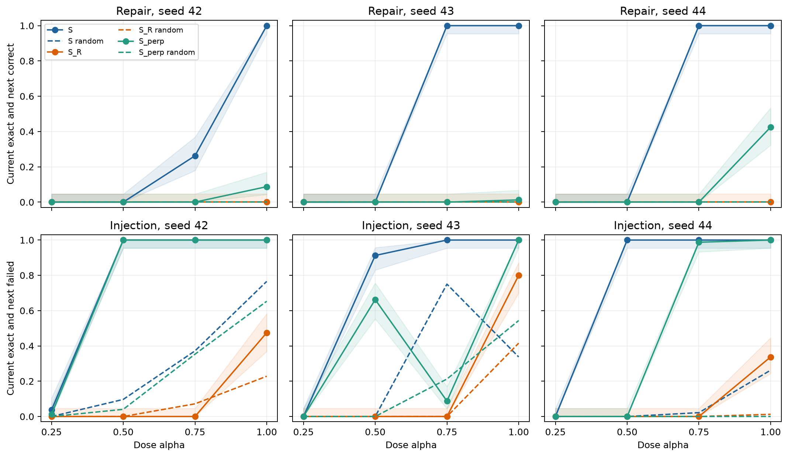
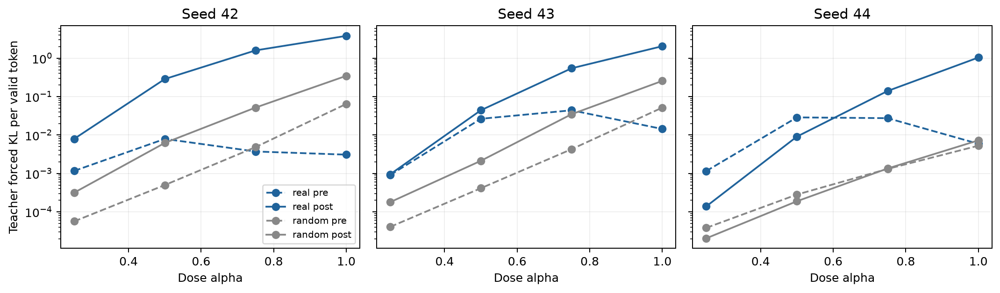
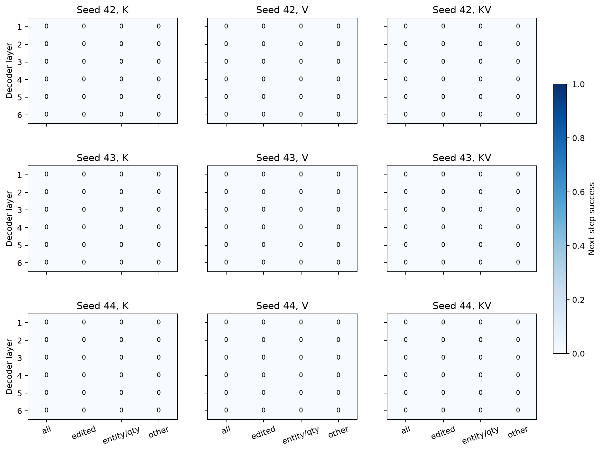
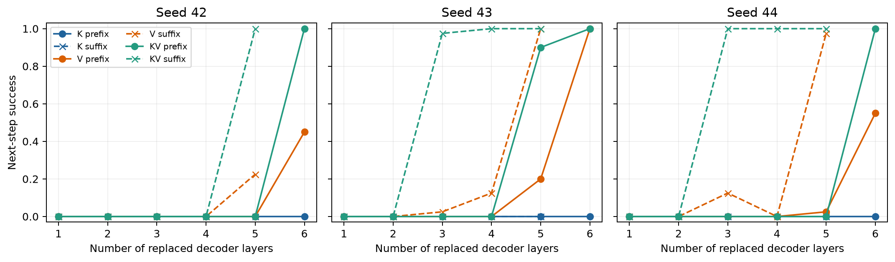
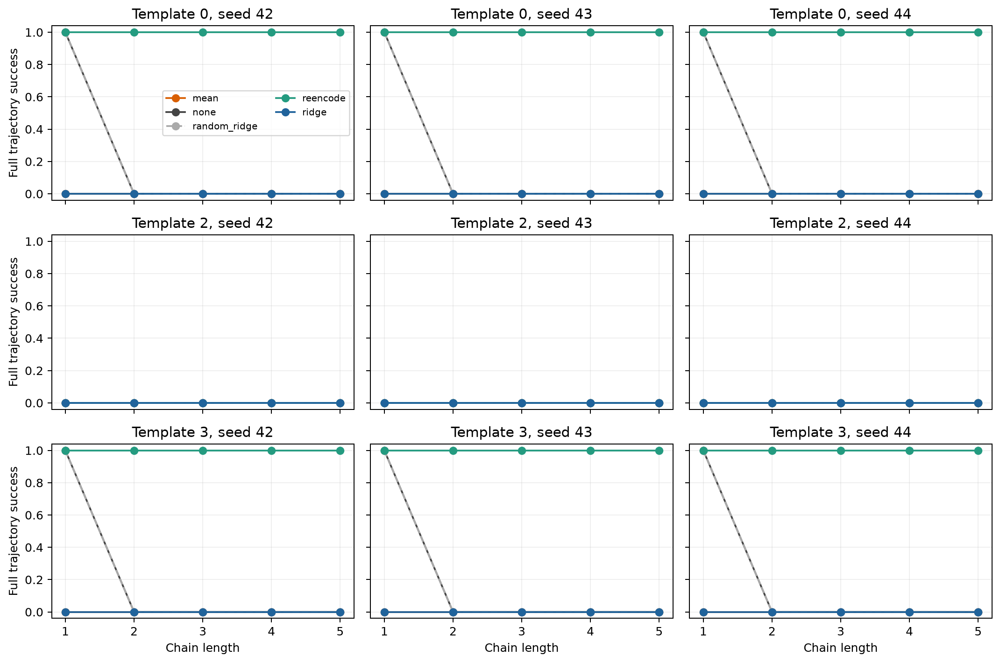

# 低维残差的因果定位与无参考修补检验

所有实验使用冻结 encoder、decoder 和编辑器，神经网络参数更新次数为 0。反向注入与编辑前后可见性检验支持一个具体机制：低维残差可以保留当前输出，却在下一次编辑后改变 decoder 分布并导致续步失败。每步均值或线性回归投影的完整轨迹结果见下表；它们没有建立可替代重编码的方法。

本轮的机制证据来自三个 seed 各 80 个历史分析留出 worlds。它们未参与子空间或规范分布拟合，但已经在前轮被评估，因此不是新的独立确认集。所有成功率和置信区间逐 seed 报告，不把随机方向当成额外独立样本。

## 原始读取空间修补是交互结构

旧实验的完整参考修补分为读取分量与正交补分量。以下是原始全差分的 2×2 设计；无修补格为 0% 是选取当前正确、下一步失败案例的结果，不能外推到所有自然状态。

| seed | 修补分量 | 救回数 / 80 | 成功率 | 95% Wilson 区间 |
| --- | --- | --- | --- | --- |
| 42 | bad | 0 / 80 | 0.00% | [0.00, 4.58] |
| 42 | read | 0 / 80 | 0.00% | [0.00, 4.58] |
| 42 | perpendicular | 34 / 80 | 42.50% | [32.26, 53.43] |
| 42 | full | 80 / 80 | 100.00% | [95.42, 100.00] |
| 43 | bad | 0 / 80 | 0.00% | [0.00, 4.58] |
| 43 | read | 0 / 80 | 0.00% | [0.00, 4.58] |
| 43 | perpendicular | 16 / 80 | 20.00% | [12.70, 30.05] |
| 43 | full | 80 / 80 | 100.00% | [95.42, 100.00] |
| 44 | bad | 0 / 80 | 0.00% | [0.00, 4.58] |
| 44 | read | 0 / 80 | 0.00% | [0.00, 4.58] |
| 44 | perpendicular | 55 / 80 | 68.75% | [57.93, 77.85] |
| 44 | full | 80 / 80 | 100.00% | [95.42, 100.00] |

只修读取分量不能救回这批案例；正交补修好后，读取分量仍阻断一部分案例。加性概率交互分别为 57.50、80.00、31.25 个百分点。这支持正交补为主阻断与读取分量的条件作用，不能写成路径 A 被否定。

## PCA4 内修补与反向注入

记 e = bad − good，e_S = P_S e，e_SR = P_R e_S，e_Sperp = e_S − e_SR。修补为 bad − αe_component，注入为 good + αe_component。此处 S 是前轮独立 discovery worlds 拟合并冻结的 PCA4；所有 80 个评估 worlds 均不参与拟合。下一编辑器固定为 plus。

α = 1 的结果如下。修补成功要求当前文本逐字保持且下一步语义正确；注入失败要求当前逐字正确且下一步失败。区间为逐 seed 的 Wilson 区间。

| seed | 分量 | 修补救回率 [95% CI] | 注入致败率 [95% CI] |
| --- | --- | --- | --- |
| 42 | S | 100.00% [95.42, 100.00] | 100.00% [95.42, 100.00] |
| 42 | S_R | 0.00% [0.00, 4.58] | 47.50% [36.92, 58.30] |
| 42 | S_perp | 8.75% [4.30, 16.98] | 100.00% [95.42, 100.00] |
| 43 | S | 100.00% [95.42, 100.00] | 100.00% [95.42, 100.00] |
| 43 | S_R | 0.00% [0.00, 4.58] | 80.00% [69.95, 87.30] |
| 43 | S_perp | 1.25% [0.22, 6.75] | 100.00% [95.42, 100.00] |
| 44 | S | 100.00% [95.42, 100.00] | 100.00% [95.42, 100.00] |
| 44 | S_R | 0.00% [0.00, 4.58] | 33.75% [24.35, 44.64] |
| 44 | S_perp | 42.50% [32.26, 53.43] | 100.00% [95.42, 100.00] |

完整 PCA4 的等范数随机 4 维修补在三个 seed 上均为 0%，真实方向为 100%。随机方向按 world 和分量逐例匹配 Frobenius 范数，并分别限制在全空间、读取空间、正交补内。注入的随机方向也可能导致失败，尤其 seed42 与 seed43；真实方向的优势是更稳定地产生“当前逐字正确、下一步失败”的联合事件，不能宣称任意随机方向都安全。

剂量 α ∈ {0.25, 0.5, 0.75, 1} 全部评估。部分正交补修补剂量会损伤当前文本，且曲线不单调；完整剂量的当前保护不能推广到任意剂量。读取分量单独注入也能致败部分参考状态，所以 A 的作用不限于原始 2×2 设计中的条件必要性。

## 正交补残差在编辑后变得可见

v_pre 比较 D(good) 与 D(good + e_Sperp)，v_post 比较 D(T(good)) 与 D(T(good) + e_Sperp)。KL 为参考分布到扰动分布的逐有效目标 token 均值，两边使用相同 teacher forcing 标签。数值检查确认 V_next e_Sperp 近似为 0，且 T(good + e_Sperp) − T(good) = e_Sperp，故这里不是下一编辑器线性放大该残差。

| seed | KL pre | KL post | post − pre 的 95% world bootstrap CI | post / pre |
| --- | --- | --- | --- | --- |
| 42 | 0.003082 | 3.809025 | [3.7191, 3.8925] | 1236.0× |
| 43 | 0.014359 | 2.051581 | [1.9602, 2.1173] | 142.9× |
| 44 | 0.005918 | 1.039411 | [0.9803, 1.0913] | 175.6× |

当前 KL 小而不严格为零，三个 seed 的当前自由解码均逐字保持。编辑后的 KL 明显增大，反向注入同时导致下一步全部失败。可以写“当前输出不变、当前分布低敏感，编辑后显著可见”，不能写成数学意义的 decoder 零空间。等范数随机正交补方向的 pre/post KL 和差值置信区间保留在 [可见性表](results/visibility_summary.csv)。

## Decoder 激活修补

在每个 seed 预先固定的前 40 个 worlds 上，逐层替换 native cross-attention 的 K、V、K 与 V；memory token 分为被编辑的时间短语、实体或数量词、其余位置。所有层与组都报告，未用结果选择分析样本。图中层号为 1–6，CSV 中为 0–5。

所有单层 K/V 与 token 组修补的救回率均为 0%。以下区间分别适用于每一层的 40 个 worlds，不把 6 层合并为 240 个独立样本；完整逐层逐位置区间见 [decoder 表](results/decoder_summary.csv)。

| seed | 替换 | 层（1 起） | 救回数 / 40 | 成功率 | 95% CI |
| --- | --- | --- | --- | --- | --- |
| 42 | K | 各层 1–6 | 0 / 40 | 0.00% | [0.00, 8.76] |
| 42 | V | 各层 1–6 | 0 / 40 | 0.00% | [0.00, 8.76] |
| 42 | KV | 各层 1–6 | 0 / 40 | 0.00% | [0.00, 8.76] |
| 43 | K | 各层 1–6 | 0 / 40 | 0.00% | [0.00, 8.76] |
| 43 | V | 各层 1–6 | 0 / 40 | 0.00% | [0.00, 8.76] |
| 43 | KV | 各层 1–6 | 0 / 40 | 0.00% | [0.00, 8.76] |
| 44 | K | 各层 1–6 | 0 / 40 | 0.00% | [0.00, 8.76] |
| 44 | V | 各层 1–6 | 0 / 40 | 0.00% | [0.00, 8.76] |
| 44 | KV | 各层 1–6 | 0 / 40 | 0.00% | [0.00, 8.76] |

自替换逐位复现原 logits；全部层同时替换参考 K/V 复现参考 logits 与生成 token；每次修补后 hooks 清除。这些是实现有效性检查。K/V donor 来自完整参考续步 T(good)，包含全差分，不是仅替换 PCA4 正交补造成的激活变化。局部修补成功定位的是足以救回的干预点，不能据此宣称唯一因果回路或该分量的唯一中介。teacher forcing 的目标 token margin、逐层 Q 差异和 KL 也保存于原始 decoder 记录。

事前规定的单层与 token 组修补全部为 0%。因此补做累计前缀与后缀层修补，沿用同一固定 40 worlds，不增加或挑选评估案例。该累计分析明确为结果出现后的补充分析，全部条件与置信区间见 [累计 K/V 表](results/decoder_cumulative_summary.csv)。

| seed | 累计前缀层数 | K 救回率 | V 救回率 | KV 救回率 |
| --- | --- | --- | --- | --- |
| 42 | 1 | 0.00% | 0.00% | 0.00% |
| 42 | 2 | 0.00% | 0.00% | 0.00% |
| 42 | 3 | 0.00% | 0.00% | 0.00% |
| 42 | 4 | 0.00% | 0.00% | 0.00% |
| 42 | 5 | 0.00% | 0.00% | 0.00% |
| 42 | 6 | 0.00% | 45.00% | 100.00% |
| 43 | 1 | 0.00% | 0.00% | 0.00% |
| 43 | 2 | 0.00% | 0.00% | 0.00% |
| 43 | 3 | 0.00% | 0.00% | 0.00% |
| 43 | 4 | 0.00% | 0.00% | 0.00% |
| 43 | 5 | 0.00% | 20.00% | 90.00% |
| 43 | 6 | 0.00% | 100.00% | 100.00% |
| 44 | 1 | 0.00% | 0.00% | 0.00% |
| 44 | 2 | 0.00% | 0.00% | 0.00% |
| 44 | 3 | 0.00% | 0.00% | 0.00% |
| 44 | 4 | 0.00% | 0.00% | 0.00% |
| 44 | 5 | 0.00% | 2.50% | 0.00% |
| 44 | 6 | 0.00% | 55.00% | 100.00% |

累计后缀 KV 修补中，seed42 的最后 5 层救回 100%，seed43 的最后 3 层为 97.5%，seed44 的最后 3 层为 100%。全部 6 层只替换 K 仍是 0%；只替换 V 分别为 45%、100%、55%。部分层组合不单调，因此应写成所测多层干预共同足以恢复，不能把效果压缩为普适的单层或单一 K/V 原因。

## 子空间可否泛化和共享

新 PCA4 仅用原训练 split 的固定 96 个 worlds 拟合；三个 seed 均有 96 个当前逐字正确且规范续步正确、编辑续步失败的训练案例。规范协方差与投影回归使用这些训练 worlds 的模板 0、1 和状态 −3 到 3，评估内容组合与拟合内容组合互斥。新子空间与旧 discovery 子空间最大主角小于 3.6°，平均 cos² 超过 0.998。

| 目标 seed | S 来源 | 模板 | 可修补 / 预定 worlds | 联合成功率 [95% CI] |
| --- | --- | --- | --- | --- |
| 42 | 42 | 0 | 80 / 80 | 100.00% [95.42, 100.00] |
| 42 | 42 | 2 | 0 / 80 | NA |
| 42 | 42 | 3 | 80 / 80 | 100.00% [95.42, 100.00] |
| 42 | 43 | 0 | 80 / 80 | 0.00% [0.00, 4.58] |
| 42 | 43 | 2 | 0 / 80 | NA |
| 42 | 43 | 3 | 80 / 80 | 0.00% [0.00, 4.58] |
| 42 | 44 | 0 | 80 / 80 | 0.00% [0.00, 4.58] |
| 42 | 44 | 2 | 0 / 80 | NA |
| 42 | 44 | 3 | 80 / 80 | 0.00% [0.00, 4.58] |
| 43 | 42 | 0 | 80 / 80 | 10.00% [5.15, 18.51] |
| 43 | 42 | 2 | 0 / 80 | NA |
| 43 | 42 | 3 | 80 / 80 | 17.50% [10.72, 27.26] |
| 43 | 43 | 0 | 80 / 80 | 100.00% [95.42, 100.00] |
| 43 | 43 | 2 | 0 / 80 | NA |
| 43 | 43 | 3 | 80 / 80 | 100.00% [95.42, 100.00] |
| 43 | 44 | 0 | 80 / 80 | 100.00% [95.42, 100.00] |
| 43 | 44 | 2 | 0 / 80 | NA |
| 43 | 44 | 3 | 80 / 80 | 100.00% [95.42, 100.00] |
| 44 | 42 | 0 | 80 / 80 | 0.00% [0.00, 4.58] |
| 44 | 42 | 2 | 0 / 80 | NA |
| 44 | 42 | 3 | 80 / 80 | 7.50% [3.48, 15.41] |
| 44 | 43 | 0 | 80 / 80 | 96.25% [89.55, 98.72] |
| 44 | 43 | 2 | 0 / 80 | NA |
| 44 | 43 | 3 | 80 / 80 | 97.50% [91.34, 99.31] |
| 44 | 44 | 0 | 80 / 80 | 100.00% [95.42, 100.00] |
| 44 | 44 | 2 | 0 / 80 | NA |
| 44 | 44 | 3 | 80 / 80 | 100.00% [95.42, 100.00] |

模板 0 为 IID，模板 2 为词汇 OOD，模板 3 额外携带绝对日期。模板 2 的历史与规范状态 token mask 全部不同，逐 token 参考差分修补记为 NA，不能当成 0% 泛化。模板 2 仍纳入无参考预测与每步投影。模板 3 mask 相同，直接检验了结构 OOD 的参考修补。

三个 seed 之间主角最高约 45–49°，平均 cos² 为 0.687–0.767，具有部分重合但不是相同子空间。直接跨 seed 修补与以下读取分量已修好后的跨 seed 控制应一起解读，不能从直接转移失败就排除所有共享的 decoder 方向。

| 目标 seed | S 来源 | 模板 | 读取分量修好后的成功率 [95% CI] |
| --- | --- | --- | --- |
| 42 | 42 | 0 | 100.00% [95.42, 100.00] |
| 42 | 42 | 3 | 100.00% [95.42, 100.00] |
| 42 | 43 | 0 | 0.00% [0.00, 4.58] |
| 42 | 43 | 3 | 0.00% [0.00, 4.58] |
| 42 | 44 | 0 | 0.00% [0.00, 4.58] |
| 42 | 44 | 3 | 0.00% [0.00, 4.58] |
| 43 | 42 | 0 | 13.75% [7.85, 22.97] |
| 43 | 42 | 3 | 17.50% [10.72, 27.26] |
| 43 | 43 | 0 | 100.00% [95.42, 100.00] |
| 43 | 43 | 3 | 100.00% [95.42, 100.00] |
| 43 | 44 | 0 | 100.00% [95.42, 100.00] |
| 43 | 44 | 3 | 100.00% [95.42, 100.00] |
| 44 | 42 | 0 | 3.75% [1.28, 10.45] |
| 44 | 42 | 3 | 25.00% [16.81, 35.48] |
| 44 | 43 | 0 | 96.25% [89.55, 98.72] |
| 44 | 43 | 3 | 95.00% [87.84, 98.04] |
| 44 | 44 | 0 | 100.00% [95.42, 100.00] |
| 44 | 44 | 3 | 100.00% [95.42, 100.00] |

该控制把接收方完整读取分量修好，再加来源 PCA4 的正交补分量；它仍使用参考差分，属于机制分析，不是无参考方法。跨 seed 的部分重合与重现性不足以证明子空间仅由冻结 backbone 决定。

## 无参考失败预测

预测器使用 pooled hidden 在 S 上的 4 维马氏距离；均值与协方差仅来自规范训练编码。所需状态为自然轨迹中的当前正确状态，标签为下一步是否失败。固定 P 机制样本的下一步标签全是失败，AUROC 为 NA；把不同深度 endpoint 混在一起得到的 AUROC 易受步深混淆，不能作为下一步预测的核心证据。

历史实验 4 使用 G3 编辑器，主机制分析使用 P 编辑器。P 的 S 转到 G3 是跨编辑器测试，单独列于 [转移 AUROC](results/g4_auroc.csv)。另用生成历史轨迹的同一个冻结 G3 checkpoint，在固定前 96 个合法训练 worlds 上拟合残差 PCA，得到以下匹配编辑器对照。规范化使用 G4 的训练 worlds，历史评估 worlds 从未参与拟合。

| split | 当前步 | metric | N / 失败数 | AUROC | 95% world bootstrap CI |
| --- | --- | --- | --- | --- | --- |
| test_iid | 2 | mahal | 53 / 20 | 0.3636 | [0.2140, 0.5243] |
| test_iid | 2 | random_mahal | 53 / 20 | 0.5621 | [0.3807, 0.7333] |
| test_iid | 2 | reference_full_distance | 53 / 20 | 0.4682 | [0.2939, 0.6443] |
| test_template_ood | 2 | mahal | 41 / 32 | 0.6979 | [0.4932, 0.8889] |
| test_template_ood | 2 | random_mahal | 41 / 32 | 0.9236 | [0.8243, 0.9924] |
| test_template_ood | 2 | reference_full_distance | 41 / 32 | 0.6389 | [0.4256, 0.8409] |

逐步、混合步深与配对差值置信区间均保留在 [匹配编辑器 AUROC](results/g4_same_editor_auroc.csv) 和 [配对差值](results/g4_same_editor_paired_auroc.csv)。每个 seed 的主机制状态分布不同；历史 G3 只有一个对应 checkpoint，不能虚构三个独立 G3 seeds。

匹配编辑器的第二步上，马氏距离相对全空间参考距离在 IID 更差（配对 AUROC 差 −0.1045，95% CI [−0.1997, −0.0147]），在 OOD 小幅更好（+0.0590，[+0.0048, +0.1167]）。但 OOD 随机 4 维规范距离为 0.9236，高于 PCA4 的 0.6979。因此因果修补有效没有自动建立稳定的无参考失败预测器；不能宣称“正确距离已找到”。

## 每步无参考投影与单步保护

每步投影使用训练规范 token 的全局坐标均值，或仅从 S 正交补坐标预测 S 坐标的固定岭回归（λ = 0.001）。回归不读取待替换的 S 坐标，也不读取当前目标文本或参考编码。四组随机 4 维投影使用同样拟合流程。重编码每步只编码模型自己解码的文本，不编码 gold。

完整轨迹 R_k 要求前 k 个状态均语义正确。下面是 IID、primary 顺序的单步与五步结果；所有 1–5 步、两种顺序与 OOD 模板见 [轨迹表](results/projection_summary.csv)。

| seed | 方法 | R1 [95% CI] | R5 [95% CI] |
| --- | --- | --- | --- |
| 42 | mean | 0.00% [0.00, 4.58] | 0.00% [0.00, 4.58] |
| 42 | none | 100.00% [95.42, 100.00] | 0.00% [0.00, 4.58] |
| 42 | random_ridge | 100.00% [100.00, 100.00] | 0.00% [0.00, 0.00] |
| 42 | reencode | 100.00% [95.42, 100.00] | 100.00% [95.42, 100.00] |
| 42 | ridge | 0.00% [0.00, 4.58] | 0.00% [0.00, 4.58] |
| 43 | mean | 0.00% [0.00, 4.58] | 0.00% [0.00, 4.58] |
| 43 | none | 100.00% [95.42, 100.00] | 0.00% [0.00, 4.58] |
| 43 | random_ridge | 100.00% [100.00, 100.00] | 0.00% [0.00, 0.00] |
| 43 | reencode | 100.00% [95.42, 100.00] | 100.00% [95.42, 100.00] |
| 43 | ridge | 0.00% [0.00, 4.58] | 0.00% [0.00, 4.58] |
| 44 | mean | 0.00% [0.00, 4.58] | 0.00% [0.00, 4.58] |
| 44 | none | 100.00% [95.42, 100.00] | 0.00% [0.00, 4.58] |
| 44 | random_ridge | 100.00% [100.00, 100.00] | 0.00% [0.00, 0.00] |
| 44 | reencode | 100.00% [95.42, 100.00] | 100.00% [95.42, 100.00] |
| 44 | ridge | 0.00% [0.00, 4.58] | 0.00% [0.00, 4.58] |

词汇 OOD 模板 2 中，所有条件包括重编码的第一步都失败，因此该模板存在单步泛化的地板效应，不能据它判定长链残差是否累积或修补是否具有续步泛化能力。结构 OOD 模板 3 应单独解读。

为了定位投影失败，还将同一估计器直接应用于没有编辑残差的 held-out 规范 E(x)。下表为 IID 状态 0 的控制；模板 2、3 与状态 −1 同样执行，完整结果见 [规范状态控制](results/canonical_control_summary.csv)。

| seed | 估计器 | 规范状态语义正确率 [95% CI] | 规范输出逐字保护率 | 坐标 MSE |
| --- | --- | --- | --- | --- |
| 42 | mean | 100.00% [95.42, 100.00] | 100.00% | 0.089841 |
| 42 | random_ridge | 100.00% [95.42, 100.00] | 100.00% | 0.000332 |
| 42 | ridge | 100.00% [95.42, 100.00] | 100.00% | 0.009010 |
| 43 | mean | 100.00% [95.42, 100.00] | 100.00% | 0.085912 |
| 43 | random_ridge | 100.00% [95.42, 100.00] | 100.00% | 0.000332 |
| 43 | ridge | 100.00% [95.42, 100.00] | 100.00% | 0.012041 |
| 44 | mean | 100.00% [95.42, 100.00] | 100.00% | 0.088750 |
| 44 | random_ridge | 100.00% [95.42, 100.00] | 100.00% | 0.000332 |
| 44 | ridge | 100.00% [95.42, 100.00] | 100.00% | 0.016440 |

IID 的规范状态 0 和 −1 上，三个 seed 的均值与线性回归投影均保留 100% 当前逐字输出；同一操作在编辑状态上第一步全部失败。这支持估计器向编辑状态迁移的缺陷，而非它在规范状态上必然破坏当前文本。均值替换会去掉 S 中的规范坐标变化，如何恢复编辑状态中的正确坐标仍未解决。一个固定 λ 的线性方案失败，不能证明不存在更好的无参考预测器，也不能证明参考依赖是本质性的。没有根据这些评估结果重新调参或进行神经网络训练。

投影失败后的补充 CPU 检查使用已有 history +1 → 0 的 80 个缓存对，测量同一回归的坐标误差。该历史区别于长链第一步的 0 → −1，结果用于解释估计器迁移，不冒充同一轨迹的额外推理。

| seed | 坐标误差指标 | MSE 均值 | 95% world bootstrap CI |
| --- | --- | --- | --- |
| 42 | canonical_estimation_mse | 0.009010 | [0.0087, 0.0093] |
| 42 | edited_estimation_mse | 0.031086 | [0.0303, 0.0319] |
| 42 | unrepaired_coordinate_mse | 2.085306 | [2.0696, 2.0999] |
| 42 | complement_shift_mse | 0.023185 | [0.0226, 0.0239] |
| 43 | canonical_estimation_mse | 0.012041 | [0.0117, 0.0125] |
| 43 | edited_estimation_mse | 0.026926 | [0.0264, 0.0275] |
| 43 | unrepaired_coordinate_mse | 1.757054 | [1.7464, 1.7665] |
| 43 | complement_shift_mse | 0.013387 | [0.0130, 0.0137] |
| 44 | canonical_estimation_mse | 0.016440 | [0.0159, 0.0170] |
| 44 | edited_estimation_mse | 0.019516 | [0.0191, 0.0200] |
| 44 | unrepaired_coordinate_mse | 1.829167 | [1.8170, 1.8400] |
| 44 | complement_shift_mse | 0.005583 | [0.0054, 0.0058] |

线性代数检查确认：编辑状态上的估计误差等于规范状态估计误差，加上正交补残差经过回归系数 β 的响应。因而编辑状态中 S 外的残差可以改变预测出来的 S 坐标；“只替换 S”不等于“估计值与其他残差无关”。该诊断不是对无参考恢复的不可行性证明。

## 计算成本与复现

计时在同一冻结模型、相同 8 个 IID worlds、五步 primary 顺序上进行三次交错重复，并同步 CUDA。方法计时仅保留所需解码：无修补与投影最终解码一次，重编码每步解码一次；额外诊断解码不计入方法耗时。生成长度随失败行为改变，因此以下是实际观测成本，不是等正确性比较。

| 方法 | 每 world 中位秒数 | 相对重编码 | encoder 次数 | decoder 次数 |
| --- | --- | --- | --- | --- |
| none | 0.0970 | 1.248× | 1 | 1 |
| ridge | 0.0163 | 0.210× | 1 | 1 |
| reencode | 0.0777 | 1.000× | 5 | 5 |

总 GPU 分配时间 2978 秒（49.63 GPU 分钟），峰值并发 1 GPU；神经网络训练为 0。PCA、马氏规范分布与岭回归属于闭式分析拟合。

冻结输入、源代码快照、拟合与评估分离、逐例范数匹配、panel 数量及全部 Slurm 状态由 [审计](results/audit.json) 检查。初始 [protocol](protocol.json) 不被追改；[执行源代码快照](execution_source_manifest.json) 明确区分初始方案与后续补充控制，不冒充事前注册。[执行更正与补充](execution_amendments.json) 记录读取一致性检查误纳入 padding 后的断言修复与重跑，以及累计激活修补的事后计划；失败尝试也纳入成本。

所有 alpha、seed、world、随机方向与激活组的原始输出保留于 results。体积较大的逐步 pooled vectors 与中间缓存保留本地并从 Git 排除；[产物清单](results/artifact_manifest.json) 保存文件哈希。[复现入口](README.md) 列出各阶段运行顺序。

## 方法决策

可以保留的机制结论是：在这批冻结编辑器的受控历史状态上，主要位于下一编辑器读取空间之外的低维残差，能保持当前文本而在下一次编辑后显著改变 decoder 分布并造成续步失败；读取分量也有可验证的因果作用。

同 seed 跨 world 的参考修补与跨 seed 的共享性是两个不同问题。每步线性投影未建立长链恢复，因此目前的核心是因果定位与泛化边界，尚不是成功的无参考投影方法。读写一致性损失继续降级；续步等价目标可作为后续方法候选，本轮没有启动训练。十种旧排列只支持所测状态第二步共同失效，不能证明所有状态都与操作顺序无关。
